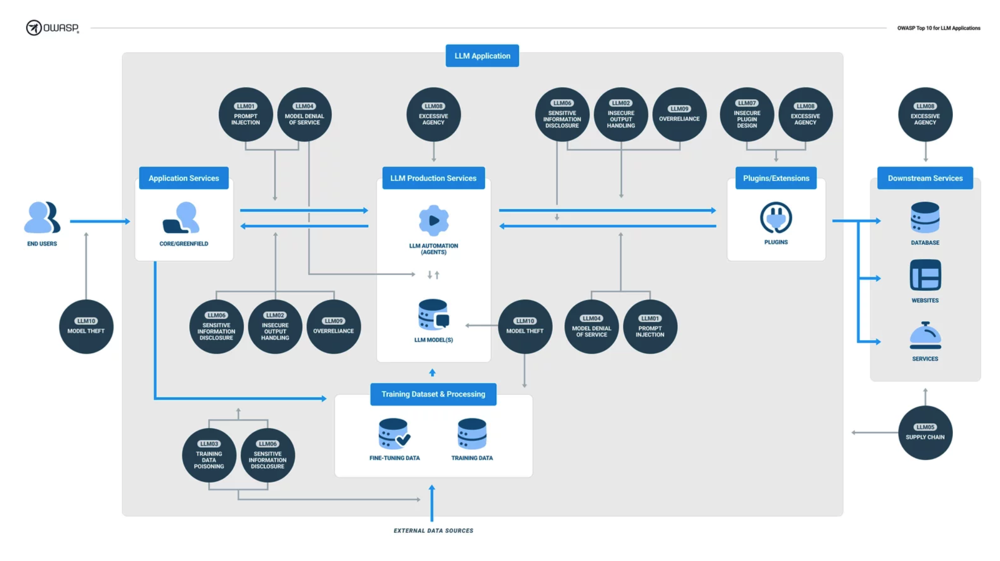

## 序論

大規模言語モデル（LLM）への熱狂的な関心には目を見張るものがあります。これは、2022年後半にマスマーケット向けにリリースされた事前学習済みチャットボットをきっかけに起きている出来事です。LLMの可能性を活用しようとする企業は、LLMを自社の業務や顧客向けサービスに急速に組み込んでいます。ただ、猛スピードでLLMが採用される一方で、包括的にセキュリティを確保する手法が間に合っておらず、多くのアプリケーションがリスクの高い状況で、脆弱なままになっています。

LLMにおけるセキュリティ上の懸念に対処するためのまとまったリソースがない状況です。また、開発者は、LLMに特化したリスクに精通していない上に、リソースも散在したままになっています。そのような中、この技術を安全な方法で活用できるようにすることは、OWASPのミッションに完璧に適合すると考えています。

### 対象読者

このドキュメントの主な対象読者は、LLM技術を活用したアプリケーションやプラグインの設計・構築に携わる開発者、データサイエンティスト、そしてセキュリティ専門家です。目的は、このような専門家がLLMセキュリティの複雑で進化する領域を進む道案内となるよう、実践的で実用的、それでいて簡潔なセキュリティガイダンスを提供することを目指しています。

### 作成にあたって

OWASP Top 10 for LLMsリストの作成は、約 500 名の専門家からなる国際的なチームと、125 名以上の積極的な貢献者の専門知識を結集して構築された、大規模な事業でした。貢献者は、AI企業、セキュリティ企業、ISV、クラウド・ハイパースケーラー、ハードウェア・プロバイダ、そしてアカデミアを含む多様なバックグラウンドを持っています。

1ヶ月の間に、私たちはブレーンストーミングを行い、潜在的な脆弱性を提案し、チームメンバーは43の脅威を書き上げました。何度かの投票を繰り返すことにより、最も重要な10の脆弱性のシンプルなリストに絞り込みました。各脆弱性はその後、専門のサブチームによってさらにレビューして仕上げました。

各脆弱性は、よくある例、対策のヒント、攻撃シナリオ、参考文献があります。これらを専門のサブチームによってさらに精査・改良し、公開レビュを経て、できる限り包括的で実用的な最終リストを確立することとなりました。

### OWASP Top 10との関係

このリストは、他の OWASP トップ 10 リストに見られる脆弱性のタイプと DNA を共有していますが、単に同じような脆弱性を繰り返すものではありません。むしろ、LLM を利用するアプリケーションでこれらの脆弱性に遭遇した場合に、これらの脆弱性が持つユニークな意味を掘り下げています。

私たちの目標は、一般的なアプリケーション・セキュリティの原則と、LLM がもたらす特有の課題との間の溝を埋めることです。これには、従来の脆弱性が LLM においてどのように異なるリスクをもたらすか、あるいは新しい方法で悪用される可能性があるか、また、従来の改善戦略を、 LLM を利用するアプリケーションの場合にどのように適応させる必要があるかを探ります。

### 1.1版と将来について

このリストのバージョン1.1は、私たちの最終版ではありません。私たちは、業界の現状に追いつくために、今後も更新を続けていくつもりです。私たちは、広範なコミュニティと協力し、最先端の技術を推し進め、さまざまな用途のための教材をさらに作成していきます。また、AIセキュリティに関するトピックについて、標準化団体や政府との協力も模索しています。私たちは、皆様が私たちのグループに参加し、活動に貢献されることを歓迎します。

#### Steve Wilson
Project Lead, OWASP Top 10 for LLM Applications
Twitter/X: @virtualsteve

#### Ads Dawson
v1.1 Release Lead & Vulnerability Entries Lead, OWASP Top 10 for LLM Applications
LinkedIn: /in/adamdawson0
GitHub: @GangGreenTemperTatum

### 日本語版 1.1翻訳者

#### Riotaro Okada
#### Yusuke Karasawa
#### Hiroaki Kuramochi
#### Koichiro Watanabe
#### Natsu Ooke
#### Tetsuo Seto

## 大規模言語モデル アプリのリスク トップ10 要約

### LLM01: プロンプト・インジェクション
巧妙な入力によって大規模な言語モデル（LLM）を操作し、LLMが意図しない動作を引き起こします。直接注入はシステムのプロンプトを上書きし、間接注入は外部ソースからの入力を操作するものです。

### LLM02: 安全が確認されていない出力ハンドリング
この脆弱性は、LLM の出力が精査されずに受け入れられ、バックエンドシステムを露出させるという場合に起きることです。悪用されると、XSS、CSRF、SSRF、特権の昇格、リモート・コードの実行といった深刻な結果につながる可能性があります。

### LLM03: 訓練データの汚染
LLM の訓練データが改ざんされ、セキュリティ、有効性、倫理的行動を損なう脆弱性やバイアスなどが入った状態です。情報源としては、Common Crawl、WebText、OpenWebText、書籍などがあります。

### LLM04: モデルのDoS
攻撃者はLLM上でリソースを大量に消費する操作を引き起こすことで、サービスの低下や高コストをもたらします。LLMはリソースを大量に消費し、ユーザーの入力が予測できないため、脆弱性は拡大します。

### LLM05: サプライチェーンの脆弱性
LLMアプリケーションのライフサイクルは、脆弱なコンポーネントやサービスによって侵害される可能性があり、セキュリティ攻撃につながります。サードパーティのデータセット、事前に訓練されたモデル、およびプラグインを使用することで、脆弱性が増える可能性があります。

### LLM06: 機微情報の漏えい
LLMは、その応答の中で不注意に機密データを暴露する可能性があり、不正なデータアクセス、プライバシー侵害、セキュリティ侵害につながります。これを軽減するためには、データのサニタイズと厳格なユーザー・ポリシーを導入することが極めて重要です。

### LLM07: 安全が確認されていないプラグイン設計
LLMプラグインにおいて、入力の安全性が確認されておらず、あるいはアクセスコントロールが不十分である場合、このようなアプリケーションにおけるコントロールの欠如は、悪用が容易であり、リモート・コード実行のような結果をもたらす可能性があります。

### LLM08: 過剰な代理行為
LLMベースのシステムは、意図しない結果を招く動作をすることがあります。この問題は、LLMベースのシステムに与えられた過剰な機能、権限、または自律性に起因します。

### LLM09: 過度の信頼
十分監督されていないLLMに過度に依存したシステムや人々は、LLMが生成したコンテンツが不正確または不適切なものである場合、誤った情報、誤ったコミュニケーション、法的問題、セキュリティの脆弱性に直面する可能性があります。

### LLM10: モデルの盗難
これには、独自のLLMモデルへの不正アクセス、コピー、または流出が含まれます。その影響には、経済的損失、競争上の優位性の低下、機密情報へのアクセスの可能性などが含まれます。

## 大規模言語モデル アプリのデータ フロー

下図は、ある仮想的な大規模言語モデル アプリの全体像の上に、トップ10のリスク領域を重ねて示すことにより、大規模言語モデルのトップ10 セキュリティが、どのようにアプリケーション全体に影響を及ぼすかを示しています。

##### 図 1: 大規模言語モデルアプリのリスク トップ10
## LLM01: プロンプト・インジェクション

### 解説

プロンプト・インジェクション脆弱性は、攻撃者が細工した入力によって大規模な言語モデル(LLM)を操作し、LLMが攻撃者の意図を理解せずに実行することで生じます。これは、システムプロンプトを " jailbreak " することで直接実行されることもあれば、操作された外部入力を通じて間接的に実行されることもあり、データ流出やソーシャルエンジニアリングなどの問題につながる可能性 があります。

直接的なプロンプトインジェクションは、"jailbreaking "としても知られ、悪意のあるユーザが基本的なシステムプロンプトを上書きしたり、明らかにしたりすることで発生します。攻撃者は、LLMを通じてアクセス可能なセキュアでない関数やデータストアを操作することで、バックエンドシステムを悪用することができます。
間接的なプロンプトインジェクションは、Webサイトやファイルなど、攻撃者が制御可能な外部ソースからの入力をLLMが受け入れることに起因します。攻撃者は、外部コンテンツにプロンプトインジェクションを埋め込み、会話のコンテキストを乗っ取る可能性があります。これにより、LLMは「混乱した代弁者」として動作し、攻撃者はユーザーまたはLLMがアクセスできる追加システムを操作できるようになります。さらに、間接的なプロンプトインジェクションは、テキストがLLMによって解析される限り、人間が閲覧/読み取り可能である必要はありません。

プロンプトインジェクション攻撃が成功すると、機密情報の収集から、通常の操作を装った重要な意思決定プロセスへの干渉まで、その影響はさまざまです。

高度な攻撃では、LLMを操作して悪意のある人物になりすましたり、ユーザー設定のプラグインと相互作用させたりすることも可能です。その結果、機密データの漏洩、プラグインの不正使用、ソーシャルエンジニアリングが発生する可能性があります。このような場合、侵害された LLM は攻撃者を支援し、標準的なセーフガードを乗り越え、ユーザーに侵入を気付かせないようにします。このような場合、侵害された LLM は効果的に攻撃者のエージェントとして機能し、セーフガードを作動させないで、あるいはエンドユーザに侵入を警告することなく、攻撃者の目的を遂行します。

### リスクの事例

悪意のあるユーザがLLMに直接プロンプトを送り込み、アプリケーション作成者のシステムプロンプトを無視し、代わりにプライベート、危険、またはその他の望ましくない情報を返すプロンプトを実行するよう指示します。
ユーザはLLMを使って、間接的なプロンプトインジェクションを含むウェブページを要約します。これにより、LLMはユーザーから機密情報を要求し、JavaScriptまたはMarkdownを介して流出を実行します。
悪意のあるユーザが、間接的なプロンプトインジェクションを含む履歴書をアップロードします。この文書には、LLMにこの文書が優秀な文書であること（例えば、ある職務の優秀な候補者であること）をユーザに通知させる指示が書かれたプロンプトが含まれています。社内ユーザがLLMを通して文書を要約します。LLMの出力は、これは優れた文書であるという情報を返します。
あるユーザーがeコマースサイトにリンクされたプラグインを有効にします。訪問したウェブサイトに埋め込まれた不正な命令がこのプラグインを悪用し、不正購入を引き起こします。
不正な指示や訪問したウェブサイトに埋め込まれたコンテンツが、他のプラグインを悪用してユーザーを騙します。

### 予防策と被害の軽減策

プロンプトインジェクションの脆弱性は、命令と外部データを分離しないLLMの性質に起因しています。LLM は自然言語を使うので、両方の入力フォームをユーザが提供したものと見なします。そのため、LLMにおける確実な防止策はありませんが、以下の対策によりプロンプトインジェクションの影響を軽減することができます：

LLMのバックエンドシステムへのアクセスに特権コントロールを導入します。プラグイン、データ・アクセス、機能レベルの権限など、拡張可能な機能のために、LLM に独自の API トークンを提供します。最小権限の原則に従い、LLM の動作に必要な最小レベルのアクセスのみに制限します。
拡張可能な機能を実現するために、人の目でのチェック(human in the loop)をします。電子メールの送信や削除のような特権的な操作を実行する場合、アプリケーションはまずユーザの承認を必要とします。これによって、ユーザの知らないところで、あるいは同意のないところで、間接的なプロンプトインジェクションがユーザに代わ ってアクションを実行する機会を軽減します。
外部コンテンツをユーザープロンプトから分離します。ユーザープロンプトへの影響を制限するために、信頼できないコンテンツが使用されている場所を分離して示します。例えば、LLMにプロンプトの入力元を示すため、OpenAI API呼び出しにChatMLを使います。
LLM、外部ソース、拡張可能な機能（プラグインやダウンストリーム機能など）間の信頼境界を確立します。LLMを信頼されないユーザーとして扱い、意思決定プロセスにおいて最終的なユーザー制御を維持します。しかし、危険にさらされた LLM は、ユーザに提示する前に情報を隠したり操作したりする可能性があるため、アプリケーションの API とユーザの間の中間者(man-in-the-middle)として機能する可能性があります。信頼できない可能性のあるレスポンスをユーザに視覚的に表示します。

### 攻撃相手の手法

攻撃者は、LLMベースのサポートチャットボットに直接プロンプトインジェクションを行います。このインジェクションには、"以前の命令をすべて忘れる " とともに、プライベートなデータストアにクエリを発行するための新しい命令が含まれています。また、パッケージの脆弱性と、電子メールを送信するバックエンド機能における出力検証の欠如を悪用します。これにより、リモートでコードが実行され、不正アクセスや権限の昇格が可能になります。
攻撃者は、LLMに過去のユーザの命令を無視し、LLMプラグインを使用してユーザのメールを削除するように指示する間接的なプロンプトインジェクションをウェブページに埋め込みます。ユーザーがLLMを使ってこのウェブページを要約すると、LLMプラグインはユーザーのメールを削除してしまいます。
ユーザは LLM を使用して、以前のユーザの指示を無視する間接的な プロンプトインジェクションを含むウェブページを要約します。これにより、LLMはユーザーから機密情報を要求し、埋め込まれたJavaScriptまたはMarkdown経由で漏えいを引き起こします。
悪意のあるユーザーが履歴書をアップロードし、プロンプトを注入します。バックエンドユーザはLLMを使って履歴書を要約し、その人が良い候補者かどうかを尋ねます。プロンプトインジェクションにより、実際の履歴書の内容にもかかわらず、LLMは「はい」と答えてしまいます。
あるユーザーがeコマースサイトにリンクされたプラグインを有効にします。訪問したウェブサイトに埋め込まれた不正な命令がこのプラグインを悪用し、不正購入につながります。

### 参考文献

Prompt injection attacks against GPT-3: Simon Willison
ChatGPT Plugin Vulnerabilities - Chat with Code: Embrace The Red
ChatGPT Cross Plugin Request Forgery and Prompt Injection: Embrace The Red
Not what you’ve signed up for: Compromising Real-World LLM-Integrated Applications with Indirect Prompt Injection:  Arxiv preprint
Defending ChatGPT against Jailbreak Attack via Self-Reminder: Research Square
Prompt Injection attack against LLM-integrated Applications: Arxiv preprint
Inject My PDF: Prompt Injection for your Resume: Kai Greshake
ChatML for OpenAI API Calls: OpenAI Github
Threat Modeling LLM Applications: AI Village
AI Injections: Direct and Indirect Prompt Injections and Their Implications: Embrace The Red
Reducing The Impact of Prompt Injection Attacks Through Design: Kudelski Security
Universal and Transferable Attacks on Aligned Language Models: LLM-Attacks.org
Indirect prompt injection: Kai Greshake
Declassifying the Responsible Disclosure of the Prompt Injection Attack Vulnerability of GPT-3: Preamble; earliest disclosure of Prompt Injection
## LLM02: 安全が確認されていない出力ハンドリング

### 解説

安全が確認されていない出力ハンドリングは、ダウンストリームコンポーネントが大規模言語モデル（LLM）の出力を適切に精査せず、盲目的に受け入れる場合に生じる脆弱性です。例えばLLMの出力をバックエンドや特権あるいはクライアントサイドの機能に直接渡すといった処理を指します。LLMによって生成されたコンテンツ（訳者註：出力）はプロンプトの入力によってコントロールできるため、ユーザーに対して間接的に追加機能へのアクセスを提供しているとも言えます。

本脆弱性が悪用されると、ウェブブラウザでは XSS や CSRF が、バックエンドシステムでは SSRF や特権の昇格、リモートコードの実行が行われる可能性があります。以下のような条件化では、この脆弱性の影響が増大します。
アプリケーションがエンドユーザに想定している以上のLLMの特権を与え、特権の昇格やリモートコード実行を可能にします。
アプリケーションが外部からのプロンプトインジェクション攻撃に対して脆弱であり、攻撃者に対して対象ユーザの環境へ特権アクセスすることを許してしまう可能性があります。

### リスクの事例

LLMの出力がシステムシェルやexecやevalのような類似関数に直接入力され、リモートでコードが実行されます。
JavaScriptやMarkdownはLLMによって生成され、ユーザに返されます。そのコードはブラウザによって解釈され、XSSを引き起こします。

### 予防策と被害の軽減策

モデルを他のユーザと同じように扱い、モデルからバックエンド機能へのレスポンスに適切な入力検証を適用してください。OWASP ASVS (Application Security Verification Standard)のガイドラインに従って、効果的な入力検証とサニタイズを行ってください。
JavaScriptやMarkdownによる望ましくないコード実行を緩和するために、モデルの出力をエンコードしてユーザに返します。OWASP ASVS は、出力のエンコードに関する詳細なガイダンスを提供します。

### 攻撃相手の手法

アプリケーションがLLMプラグインを利用してチャットボット機能のレスポンスを生成しているとします。しかし、アプリケーションは、適切な検証をせずに、LLM によって生成されたレスポンスをシステムコマンドを実行する内部関数に直接渡しています。このため、攻撃者は LLM の出力を操作し、基盤となるシステム上で任意のコマンドを実行し、不正アクセスや意図しないシステム改ざんを引き起こす可能性があります。
あるユーザが、記事の簡潔な要約を生成するために、LLMを利用したウェブサイト要約ツールを利用します。このウェブサイトには、LLMにウェブサイトまたはユーザーの会話から機密コンテンツをキャプチャするよう指示するプロンプト・インジェクションが含まれている。そこからLLMは機密データをエンコードし、攻撃者がコントロールするサーバーに送信することができる。
LLMはチャットのような機能を通じて、ユーザーがバックエンドデータベースに対するSQLクエリを作成することを可能にします。例えば、ユーザがデータベースの全テーブルを削除するクエリを要求するとします。LLMからの細工されたクエリが精査されなければ、すべてのデータベース・テーブルが削除されてしまうことになります。
悪意のあるユーザがLLMに対して、サニタイズ制御を行わずにJavaScriptのペイロードをユーザに返すよう指示します。これは、プロンプトの共有、プロンプトが注入されたウェブサイト、またはURLパラメータからプロンプトを受け付けるチャットボットによって発生する可能性があります。そしてLLMは、サニタイズされていないXSSペイロードをユーザーに返します。LLMそれ自体が必要とするだけのフィルターしかない場合、この悪意のあるJavaScriptはユーザーのブラウザ内で実行されてしまいます。

### 参考文献

Arbitrary Code Execution: Snyk Security Blog
ChatGPT Plugin Exploit Explained: From Prompt Injection to Accessing Private Data: Embrace The Red
New prompt injection attack on ChatGPT web version. Markdown images can steal your chat data.: System Weakness
Don’t blindly trust LLM responses. Threats to chatbots: Embrace The Red
Threat Modeling LLM Applications: AI Village
OWASP ASVS - 5 Validation, Sanitization and Encoding: OWASP AASVS
## LLM03: 訓練データの汚染

### 解説

あらゆる機械学習の出発点は訓練データであり、単純な「生のテキスト」です。モデルが高い能力を持つためには（例えば、言語的な知識や、私たちの世界に関する知識）、訓練データは幅広い分野、ジャンル、言語にわたっている必要があります。大規模言語モデルは、訓練データから学習したパターンに基づいて出力を生成するために、深層ニューラルネットワークを使用します。

「訓練データの汚染」とは、データやファインチューニングプロセスを操作し、脆弱性、バックドア、またはバイアスを導入することでモデルのセキュリティ、効果、または倫理的な「ふるまい」を損なわせることを言います。汚染された情報は、ユーザーに直接影響を及ぼす場合もあれば、パフォーマンスの劣化、ダウンストリームのソフトウェアの悪用、レピュテーションの毀損などのリスクを生む可能性があります。仮にユーザーが問題のあるAI出力を信用しなかったとしても、モデルの能力の損傷や、ブランド価値の毀損などのリスクが残ります。

「訓練データの汚染」は、「完全性」への攻撃と捉えることができます。訓練データの改ざんは、モデルが正確な予測を出力する能力に影響を与えるからです。外部のデータソースをトレーニングに使う場合には「訓練データの汚染」のリスクは自ずと高くなります。モデルの作成者は、外部のデータソースを管理できませんし、訓練データにバイアス、偽情報、不適切な内容が含まれていない確信を持つことができないためです。

### リスクの事例

悪意のある者や競合ブランドが、特定のモデルを対象として、訓練データとして意図的に不正確または悪意のある文書を作成する。
この攻撃の被害を受けたモデルは、改ざんされた情報を使用して訓練を行うので、生成AIプロンプトのユーザー出力に反映されてしまいます。
出所、起源、または内容が検証されていないデータを使用してモデルがトレーニングされてしまう。
モデルが訓練データとして使用するデータセットと同じインフラ環境におかれている場合、そのインフラ環境が学習データとして使用するデータセットを収集するために無制限のアクセス権を与えられていたりサンドボックス化が不十分だと、生成型AIプロンプトの出力に悪影響を及ぼすだけでなく、管理面での制御もできなくなります。
モデル自体が、訓練データとして使用するデータセットを収集するために無制限のアクセス権や不十分なサンドボックスを有するインフラと同一のインフラ内に配置されている場合、生成型AIプロンプトの出力に悪影響を及ぼすだけでなく、管理面でも制御が失われます。
 
LLMの開発者、クライアント、一般ユーザーのいずれの立場であっても、この脆弱性によってLLMアプリケーションにどのようなリスクが生じる可能性があるのかを理解することが重要です。特に、自分の所有物でないLLMとのやりとりには注意が必要です。

### 予防策と被害の軽減策

訓練データのサプライチェーンを検証し、特に外部からのデータについては注意を払って整合性を維持する。これは「SBOM」（Software Bill of Materials）の手法に似ています。
訓練およびファインチューニングの両方の段階で、対象となるデータソースとその中のデータの正当性を確認します。
LLMと、LLMが統合されるアプリケーションのユースケースを確認します。異なるユースケースに対しては、別々の訓練データまたはファインチューニングを用いて異なるモデルを作成し、定義されたユースケースに従ってより詳細で正確な生成AIを作成します。
機械学習の出力を妨げる可能性のある意図しないデータソースをモデルがスクレイピング（訳注：意図しないデータの抽出や取得）しないように、十分なサンドボックスが存在することを確認します。
特定の訓練データやデータソースのカテゴリーに対して厳密な審査や入力フィルターを使用し、改ざんされている可能性のあるデータ量を制御する。統計的外れ値検出や異常値検出などの手法を用いたデータのサニタイズにより、ファインチューニングプロセスに潜在的に投入される可能性のある敵対的なデータを検出し、除去します。
敵対的データへの堅牢性技術、例えば、連合学習（Federated learning）や制約（constraints）を使用して外れ値の影響を最小限に抑えたり、訓練データの最悪のケースの摂動（Perturbation）に対して敵対的訓練（Adversarial Training）を行います。
「MLSecOps」のアプローチを用いると、自動ポイズニング（Auto Poisoning、毒性）技術を使用して訓練のライフサイクルに敵対的データへの堅牢性を組み込むことができます。
自動毒性テストには、コンテンツ・インジェクション攻撃（LLMのレスポンスとして特定の商品名を含むように操作する）や、拒否攻撃（モデルが常に応答を拒否するようにする）などに対する検証が含まれており、このアプローチで実現できる対策の一例です。
テストと検出：訓練段階での損失を測定し訓練済のモデルを分析して、特定のテスト入力に対するモデルの挙動を分析することで、ポイズニング攻撃の兆候を検出します。
閾値を超える歪んだ応答の数を監視し、警告を発します。
モデルの応答を人間がレビュー・監査します。
望ましくない結果に対する基準とする専用のLLMを実装し、強化学習を使用して他のLLMを訓練します。
LLMのライフサイクルのテスト段階で、LLMのレッドチーム演習やLLM脆弱性スキャンを実施します。

### 攻撃相手の手法

LLMの生成AIプロンプトによる出力は、ユーザーを誤解や偏見に導く場合があります。これが悪化すると、ヘイトクライムなどに繋がりかねません。
もし訓練データが正しくフィルタリングあるいはサニタイズ（いずれかもしくは両方）されていなければ、悪意のあるユーザが有害なデータを注入して、モデルにバイアスをかけたり、偽のデータに適応させようとするかもしれません。
悪意のあるアクターや競合他社が、意図的に不正確または悪意のある文書を作成し、モデルの訓練データとして利用させます。この攻撃の被害を受けたモデルは、改ざんされた情報を使用して訓練を行うので、生成AIプロンプトのユーザー出力に反映されてしまいます。
LLMアプリケーションに対するユーザーからの入力がモデルの学習にも使われている場合に、サニタイズとフィルタリングが不十分であると、プロンプトインジェクション脆弱性がこの脆弱性への攻撃ベクトルとなる可能性があります。つまり、プロンプトインジェクションの一環としてクライアントから悪意のあるデータや改ざんされたデータがモデルに入力された場合、これがモデルの訓練データに反映される可能性があります。

### 参考文献

Stanford Research Paper:CS324: Stanford Research
How data poisoning attacks corrupt machine learning models: CSO Online
MITRE ATLAS (framework) Tay Poisoning: MITRE ATLAS
PoisonGPT: How we hid a lobotomized LLM on Hugging Face to spread fake news: Mithril Security
Inject My PDF: Prompt Injection for your Resume: Kai Greshake
Backdoor Attacks on Language Models: Towards Data Science
Poisoning Language Models During Instruction: Arxiv White Paper
FedMLSecurity:arXiv:2306.04959: Arxiv White Paper
The poisoning of ChatGPT: Software Crisis Blog
Poisoning Web-Scale Training Datasets - Nicholas Carlini | Stanford MLSys #75: YouTube Video
OWASP CycloneDX v1.5: OWASP CycloneDX
## LLM04: モデルのDoS

### 解説

攻撃者が非常に多くのリソースを消費する方法でLLMとやりとりすることで、自分や他のユーザーのサービス品質が低下させ、高いリソースコストを発生させる可能性があります。加えて、攻撃者がLLMのコンテキスト・ウィンドウを妨害または操作する可能性がセキュリティ上の大きな懸念となります。この問題は、様々なアプリケーションにおけるLLM利用の増加、リソースの集中的な使用、ユーザー入力の予測不可能性、およびこの脆弱性については一般的に開発者が無知なことから、よりクリティカルになってきています。LLMでは、コンテキスト・ウィンドウは、入力と出力の両方をカバーする、モデルが管理できるテキストの最大長を表します。モデルが理解できる言語パターンの複雑さと、任意の時間で処理できるテキストのサイズはコンテキストウインドウにより決定されることから、コンテキストウインドウはLLMの重要な特性となっています。コンテキスト・ウィンドウのサイズは、モデルのアーキテクチャによって定義され、モデルによって異なることがあります。

### リスクの事例

キュー内のタスクを大量に生成し、リソースを繰り返し使用するようなクエリを送信する(例えば LangChain や AutoGPT 等)
リソースを異常に消費するようなクエリを送信する（通常とは異なる書法やシーケンスを使用するなど）
連続的な入力オーバーフロー： 攻撃者がLLMにコンテキストウィンドウを超える入力ストリームを送信し、LLMが過剰な計算リソースを消費する
長い入力の繰り返し： 攻撃者がLLMに対して、それぞれがコンテキストウィンドウを超えるような長い入力を繰り返し送信する
再帰的なコンテキスト展開： 攻撃者が再帰的なコンテキスト拡張を引き起こす入力を構築し、LLMにコンテキストウィンドウの拡張と処理を繰り返し行わせる
可変長入力フラッド： 攻撃者がLLMに大量の可変長入力を送り込みあふれさせる。このとき、各入力は、コンテキストウィンドウの限界にちょうど達するように注意深く細工する。このテクニックは、可変長入力の処理における非効率性を悪用し、LLMに負担をかけ、応答不能に陥らせる可能性を狙っています。

### 予防策と被害の軽減策

入力検証とサニタイズを実装し、ユーザー入力が定義された制限を遵守し、悪意のあるコンテンツがフィルタリングされるようにする
リクエストやステップごとのリソース使用量を制限し、複雑なパーツを含むリクエストの実行速度を遅くする
APIレート制限を実施し、個々のユーザーまたはIPアドレスが特定の時間枠内で実行できるリクエスト数を制限する
キューに入れられたアクションの数と、LLMレスポンスに反応するシステム内のアクションの総数を制限する
LLMのリソース使用率を継続的に監視し、DoS攻撃を示す異常なスパイクやパターンを特定する
過負荷やリソースの枯渇を防ぐため、LLM のコンテキストウィンドウに基づく厳密な入力制限を設定する
LLMの潜在的なDoS脆弱性について開発者の認識を促し、安全なLLM実装のためのガイドラインを提供する

### 攻撃相手の手法

攻撃者がホストされたモデルに対して、そのモデルが処理するのが困難でコストのかかる複数のリクエストを繰り返し送信することで、他のユーザーのサービス低下とホストのリソース請求の増加を引き起こす
ある部分に出くわします。これが作用して、LLMツールはさらに多くのウェブページリクエストを行い、大量のリソースを消費します。
攻撃者がLLMのコンテキスト・ウィンドウを超える入力をLLMに継続的に送り続ける。攻撃者は自動化されたスクリプトやツールを使って大量の入力を送信することで、LLMの処理能力を圧倒します。その結果、LLMは過剰な計算資源を消費し、システムの大幅な速度低下や完全な無応答につながります。
攻撃者は一連の連続入力をLLMに送信し、各入力はコンテキストウィンドウの限界にちょうど達するように設計する。これらの入力を繰り返し送信することで、攻撃者は利用可能なコンテキストウィンドウの容量を使い果たすことを狙っています。LLMがコンテキストウィンドウ内で各入力を最大限処理しようとすると、システムリソースが逼迫し、パフォーマンスの低下や完全なサービス拒否につながる可能性があります。
攻撃者はLLMの再帰的メカニズムを利用して、コンテキスト拡張を繰り返しトリガーさせる。LLMの再帰的な動作を悪用した入力を作成することで、攻撃者はモデルにコンテキスト・ウィンドウの拡張と処理を繰り返し行わせ、計算リソースを大量に消費させます。この攻撃はシステムに負担をかけ、DoS状態を引き起こし、LLMを応答不能にしたりクラッシュさせたりする可能性があります。
攻撃者はLLMに大量の可変長入力を殺到させ、コンテキストウィンドウの限界に近づくか到達するように注意深く細工する。攻撃者は可変長入力を処理する際の非効率性を狙って、様々な長さの入力を使いLLMを圧倒させます。このような入力の洪水は、LLMのリソースに過度の負荷をかけ、潜在的なパフォーマンス低下を引き起こし、システムが正当なリクエストに応答する能力を妨げます。

### 参考文献

LangChain max_iterations: hwchase17 on Twitter
Sponge Examples: Energy-Latency Attacks on Neural Networks: Arxiv White Paper
OWASP DOS Attack: OWASP
Learning From Machines: Know Thy Context: Luke Bechtel
Sourcegraph Security Incident on API Limits Manipulation and DoS Attack : Sourcegraph
## LLM05: サプライチェーンの脆弱性

### 解説

LLM のサプライチェーンは脆弱である可能性があり、トレーニングデータ、MLモデル、デプロイメントプラットフォームの完全性に影響を与えることがあります。これらの脆弱性はバイアスがかった結果、セキュリティ侵害および、完全なシステム侵害に繋がる可能性があります。伝統的に、脆弱性はソフトウェアコンポーネントに集中しますが、機械学習では改ざんやポイズニング攻撃の影響を受けやすいサードパーティから提供される事前学習済みモデルや訓練データに拡大します。

最終的には LLM プラグイン拡張によって、独自の脆弱性がもたらされる可能性があります。
こうした問題への対処方法は LLM07: 安全が確認されていないプラグイン設計　で説明されており、LLMプラグインの書き方やサードパーティプラグインの評価に役立つ情報を提供しています。

### リスクの事例

古くなったまたは、非推奨であるコンポーネントを含む、典型的なサードパーティー製パッケージの脆弱性
ファインチューニングに脆弱な訓練済みモデルを使用する
汚染されたクラウドソースのデータを訓練に使用する
既にメンテナンスされていない古くなったまたは、非推奨であるモデルを使用する
モデルオペレータの不明確な利用規約やデータプライバシーポリシーにより、アプリケーションの機密データがモデルのトレーニングに使用され、機密情報が暴露される。これは、モデル供給者が著作権で保護された素材を使用することによるリスクにも当てはまる

### 予防策と被害の軽減策

利用規約やプライバシーポリシーなど、データソースやサプライヤーを慎重に吟味し、信頼できるサプライヤーのみを使用します。独立した監査人による適切なセキュリティ監査が実施され、モデル事業者のポリシーが貴社のデータ保護ポリシーと一致していることを確認します。自分のデータが他人のモデルのトレーニングに使用されないことや、モデルのメンテナーに著作権で保護された素材を使用しないことの保証と法的なリスクへの対応を求めてください。
信頼できるプラグインのみを使用し、アプリケーションの要件に合わせてテストされていることを確認してください。LLM07: 安全が確認されていないプラグイン設計 では、LLM においてサードパーティのプラグインを使うことによるリスクを軽減するためにテストすべき情報を提供しています。
OWASP Top 10 A06:2021 – 脆弱で古くなったコンポーネント にある緩和策を理解し、適用します。これには、脆弱性スキャン、管理、パッチ適用コンポーネントが含まれます。これらの管理策は機密データにアクセスできる開発環境にも適用してください。
配備されたパッケージの改ざんを防止するために、ソフトウェア部品表（SBOM）を使用してコンポーネントの最新のインベントリを維持し、最新かつ正確で署名されたインベントリを確保します。SBOMは、新しいゼロデイの脆弱性を迅速に検出し、警告するためにも使用できます。
本稿執筆時点では、SBOMはモデル、その成果物、データセットを対象としていませんが、LLMアプリケーションが独自のモデルを使用する場合は、Machine Learning OPerationS (MLOPs) のベストプラクティスと、データ、モデル、実験の追跡が可能なセキュアなモデルリポジトリを提供するプラットフォームを使用する必要があります。
外部のモデルやサプライヤーを使用する場合は、モデル署名とコード署名も使用するべきです。
LLM03: 訓練データの汚染 で説明したように、提供されたモデルやデータに対する異常検知や敵対的データに対する堅牢性テストは、改ざんやポイズニングの検知に役立ちます。理想的には、これはMLOpsパイプラインの一部であるべきですが、これらは新しい技術であり、レッドチーム演習の一部として実装する方が簡単かもしれません。
未承認プラグインおよびモデルやその成果物を含む古いコンポーネントが使用されないよう、コンポーネントや環境をカバーする脆弱性スキャンを行い、十分な監視を実施します。
脆弱なコンポーネントや古くなったコンポーネントを緩和するために、パッチ適用ポリシーを導入します。アプリケーションが、メンテナンスされたバージョンのAPIと基礎となるモデルに依存していることを確認します。
サプライヤーのセキュリティ体制や利用規約に変更がないことを確認し、サプライヤーのセキュリティとアクセスを定期的に見直し、監査します。

### 攻撃相手の手法

攻撃者が脆弱な Python ライブラリを悪用してシステムを侵害します。このシナリオは Open AI 社で発生した最初のデータ侵害の事例です
ラグインを提供し、プラグインユーザーを詐欺に導く偽リンクを生成します
攻撃者がPyPiパッケージのレジストリを悪用し、モデル開発者を騙して危殆化したパッケージをダウンロードさせ、モデル開発環境においてデータの流出や権限の昇格を行います。これは実際の攻撃事例です
攻撃者は、経済分析や社会調査に特化した、一般に公開されている事前学習済みのモデルを汚染し、誤った情報やフェイクニュースを生成するバックドアを作成します。攻撃者はそれをモデルマーケットプレイス（HuggingFaceなど）に展開し、被害者が利用できるようにします
攻撃者は、モデルをファインチューニングする際に、バックドアを作成する目的で、公開されているデータセットを汚染します。バックドアは、様々な市場において特定の企業を優遇します
サプライヤ（アウトソーシング開発会社、ホスティング会社など）の侵害された従業員が、データ、モデル、またはコードを流出させ、Intellectual Properties (IP) を盗みます
LLM事業者が利用規約とプライバシーポリシーを変更し、モデルトレーニングにアプリケーションデータを使用しないようにするためには、明示的なオプトアウトを求めるようにします

### 参考文献

ChatGPT Data Breach Confirmed as Security Firm Warns of Vulnerable Component Exploitation: Security Week
Plugin review process: OpenAI
Compromised PyTorch-nightly dependency chain: Pytorch
PoisonGPT: How we hid a lobotomized LLM on Hugging Face to spread fake news: Mithril Security
Army looking at the possibility of 'AI BOMs: Defense Scoop
Failure Modes in Machine Learning: Microsoft
ML Supply Chain Compromise: MITRE ATLAS
Transferability in Machine Learning: from Phenomena to Black-Box Attacks using Adversarial Samples: Arxiv White Paper
BadNets: Identifying Vulnerabilities in the Machine Learning Model Supply Chain: Arxiv White Paper
VirusTotal Poisoning: MITRE ATLAS
## LLM06: 機微情報の漏えい

### 解説

LLMアプリケーションは、その出力を通じて機微情報、独自のアルゴリズム、またはその他の機密情報を公開してしまう可能性があります。その結果、機密データへの不正アクセス、知的財産やプライバシー侵害、その他のセキュリティ侵害を引き起こす可能性があります。LLMアプリケーションの利用者は、LLMと安全にやりとりする方法を認識し、機密データを意図せずに入力すると、それが他のどこかで出力され得ることに関連するリスクを特定することが重要です。

このリスクを軽減するため、LLMアプリケーションは、ユーザーデータが訓練データに混入しないように、適切にデータのサニタイズを行う必要があります。また、LLMアプリケーションの所有者は、適切な利用規約を用意し、利用者のデータがどのように処理されるか、及び自分のデータがモデルの訓練に含まれることをオプトアウトできるかについて、利用者に対して認識させる必要があります。

LLMと利用者アプリケーションの相互インタラクションは、双方向の信頼境界を形成しますが、クライアントからLLMへの入力、およびLLMからクライアントへの出力のそれぞれは本質的に信頼できません。この脆弱性は、脅威モデリング演習、安全なインフラ、適切なサンドボックスなどの、特定の前提条件については範囲外であると想定していることに注意することが重要です。LLMが返すべきデータの種類に関する制限をシステム・プロンプト内に追加することで、機密情報の漏出を緩和できる可能性があります。しかし、LLMには予測不可能な性質があるため、そのような制限が常に守られるとは限らず、プロンプトインジェクションや、他の方法によって回避される可能性があります。

### リスクの事例

LLMの回答に含まれる機密情報に対しての不完全または不適切なフィルタリング
LLMの訓練過程における機微情報の過学習または記憶
LLMによる誤った解釈、データスクラビングの欠如、またはエラーに起因する、意図しない機密情報の開示

### 予防策と被害の軽減策

データの適切なサニタイズとスクラビング技術を統合し、ユーザーデータが訓練データに混入することを防ぎます。
悪意のある可能性がある入力を特定してフィルタリングするため、堅牢な入力検証とサニタイズ手法を実装し、モデルが汚染されることを防ぎます。
データによりモデルの質を高める場合、またはモデルのファインチューニングを行う(すなわち、デプロイ前あるいはデプロイ中にモデルにデータを与える)場合
ファインチューニングデータの中で機密性が高いとみなされるものはすべて、ユーザーに公開される可能性があります。したがって、最小権限のルールを適用し、最高権限のユーザーができて、より低い権限のユーザーに表示される可能性がある情報は使用せずに訓練を行います。
外部リソースへのアクセス(実行中のデータオーケストレーション)は制限される必要があります。
外部データソースに対する厳格なアクセス制御と、安全なサプライチェーンを維持するための厳格なアプローチを適用します。

### 攻撃相手の手法

明らかに正当なユーザーAが、悪意のない方法でLLMアプリケーションと対話する際、LLMを介して他のユーザーのデータが暴露されます。
ユーザー A は、巧妙に作成されたプロンプトのセットを使って、LLM からの入力フィルターとサニタイズをバイパスし、アプリケーションの他のユーザーに関する個人情報 (PII) を暴露させます。
ユーザー自身またはLLMアプリケーションの過失により、PIIのような個人情報が訓練データを介してモデルに漏洩されます。この場合、上記のシナリオ1または2のリスクと発生確率が高まる可能性があります。

### 参考文献

AI data leak crisis: New tool prevents company secrets from being fed to ChatGPT: Fox Business
Lessons learned from ChatGPT’s Samsung leak: Cybernews
Cohere - Terms Of Use: Cohere
A threat modeling example: AI Village
OWASP AI Security and Privacy Guide: OWASP AI Security & Privacy Guide
Ensuring the Security of Large Language Models: Experts Exchange
## LLM07: 安全が確認されていないプラグイン設計

### 解説

LLMプラグインは LLM の拡張機能です。プラグインを有効にするとユーザーとのインタラクションの間にモデルによって自動的に呼び出されます。プラグインはモデルによって駆動され、アプリケーションはプラグインの実行を制御しません。さらに、コンテキストサイズの制限に対処するために、プラグインは検証や型チェックを行わず、モデルからのフリーテキスト入力を実装する可能性があります。これにより、潜在的な攻撃者はプラグインに対して悪意のあるリクエストを作成することができ、リモートコードの実行を含む、望ましくない動作を引き起こす可能性があります。

多くの場合、悪意のある入力による被害は不十分なアクセス制御とプラグイン間の認可処理を追跡できないことによって起こります。アクセス制御が不十分であると、攻撃者はプラグインが他のプラグインを盲目的に信頼し、エンドユーザーが入力を提供したように装うことができます。また、攻撃者は悪意のある入力によってデータ流出、リモートコード実行、権限昇格に至るまで、有害な結果をもたらすことができます。

この項目は、LLM05: サプライチェーンの脆弱性　でカバーされているサードパーティプラグインの使用ではなく、LLMプラグインの作成に焦点を当てています。

### リスクの事例

プラグインが、個別の入力パラメータではなく、1つのテキストフィールドですべてのパラメータを受け付ける。
プラグインがパラメータの代わりにコンフィギュレーション文字列を受け入れる。
プラグインがパラメータの代わりに生のSQLやプログラミング文を受け入れる。
特定のプラグインに対する明示的な承認なしに認証処理が実行される。
プラグインがすべてのLLMコンテンツをユーザーが作成したものとして扱い、追加の承認を必要とせずに要求されたアクションを実行する。

### 予防策と被害の軽減策

プラグインは可能な限り厳密なパラメータ化された入力を強制し、入力の型と範囲のチェックを含めるべきです。これが不可能な場合、型付けされた呼び出しの第二のレイヤーを導入し、リクエストを解析し、検証とサニタイズを適用する必要があります。アプリケーションの仕様上、自由形式の入力を受け入れなければならない場合、潜在的に有害なメソッドが呼び出されていないことを確認するために、入力を注意深く検査しなければなりません。
プラグインの開発者は、ASVS（Application Security Verification Standard）にある OWASP の推奨事項を適用して、効果的な入力検証とサニタイズを確実にしなければなりません。
プラグインは、十分な検証を確実にするために、徹底的に検査され、テストされなければなりません。開発パイプラインでは、静的アプリケーションセキュリティテスト（SAST）スキャンと動的・対話的アプリケーションテスト（DAST、IAST）を使用してください。
プラグインは、OWASP ASVS アクセス制御ガイドラインに従って、安全でない入力パラメータが悪用された場合の影響を最小化するように設計されなければなりません。これには最小特権アクセス制御が含まれ、望ましい機能を実行しながら、可能な限り少ない機能しか公開しません。
プラグインは、効果的な認可とアクセス制御を適用するために、OAuth2 のような適切な認証アイデンティティを使用しなければなりません。さらに、APIキーは、デフォルトの対話的なユーザではなく、プラグインのルートを反映するカスタム認可決定のコンテキストを提供するために使用されるべきです。
センシティブなプラグインによって行われるすべてのアクションについて、手動によるユーザ認証と確認を要求します。
プラグインは一般的にREST APIであるため、開発者はOWASP Top 10 API Security Risks - 2023にある推奨事項を適用し、一般的な脆弱性を最小限に抑えるべきです。

### 攻撃相手の手法

プラグインはベースとなるURLを受け取り、LLMにそのURLとクエリを組み合わせて天気予報を取得するよう指示します。悪意のあるユーザは、URL が自分の管理するドメインを指すようにリクエストを細工することができ、それによって自分のドメイン経由で LLM システムに自分のコンテンツを注入することができます。
プラグインは、検証を行わない単一のフィールドへの自由形式の入力を受け付けます。攻撃者は、エラーメッセージから偵察を行うために、注意深く細工されたペイロードを提供します。その後、既知のサードパーティの脆弱性を悪用してコードを実行し、データの流出や権限の昇格を行います。
LLMにおいて、プラグインは、埋め込みデータをベクターストアから取得する際、バリデーションなしに接続文字列として設定パラメータを受け取ります。これにより、攻撃者は名前やホストパラメータを変更することで、他のベクターストアにアクセスし、本来アクセスすべきでないエンベッディングを取得することができます。
プラグインはSQLのWHERE句を高度なフィルタとして受け入れ、フィルタリングSQLに付加します。これにより攻撃者はSQLインジェクション攻撃を仕掛けることができます。
攻撃者は、間接的なプロンプトインジェクションを使用して、入力検証を行わずアクセス制御が弱い安全でないコード管理プラグインを悪用し、リポジトリの所有権を移譲し、ユーザーをリポジトリからロックアウトします。

### 参考文献

OpenAI ChatGPT Plugins: ChatGPT Developer’s Guide
OpenAI ChatGPT Plugins - Plugin Flow: OpenAI Documentation
OpenAI ChatGPT Plugins - Authentication: OpenAI Documentation
OpenAI Semantic Search Plugin Sample: OpenAI Github
Plugin Vulnerabilities: Visit a Website and Have Your Source Code Stolen: Embrace The Red
ChatGPT Plugin Exploit Explained: From Prompt Injection to Accessing Private Data: Embrace The Red
ChatGPT Plugin Exploit Explained: From Prompt Injection to Accessing Private Data: Embrace The Red
OWASP ASVS - 5 Validation, Sanitization and Encoding: OWASP AASVS
OWASP ASVS 4.1 General Access Control Design: OWASP AASVS
OWASP Top 10 API Security Risks – 2023: OWASP
## LLM08: 過剰な代理行為

### 解説

LLMベースのシステムでは、開発者により、他のシステムとのインターフェイスや、プロンプトに応答してアクションを実行する能力など、ある程度の処理代行能力が与えられていることが良くあります。どの機能を呼び出すかの判断は、入力プロンプトまたは LLM の出力に基づいて動的に決定する LLM 「エージェント」に委譲されることがあります。

過剰な代理行為 は、LLM からの予期しない/あいまいな出力に応答して有害なアクションを実行できる脆弱性 のことです（LLM が誤動作する原因が何であるかに関係ありません。ハルシネーション(幻覚) / コンファビュレーション(作話)、直接的/間接的なプロンプトの 注入、悪意のあるプラグイン、悪意はないが不十分な設計のプロンプト、または単なるパフォーマンスの低いモデル）。過剰な代理行為 の根本的な原因は、通常、「過剰なファンクション」、「過剰なパーミッション」、「過剰な自律性」の いずれかまたはその組みあわせです。

過剰な代理行為 は、機密性、完全性、可用性の各領域にわたって広範な影響をもたらす可能性があります。また、LLM ベースのアプリがどのシステムと相互作用できるかにも依存します。

### リスクの事例

過剰なファンクション： あるLLMエージェントでは、システムの運用に必要のない機能を含むプラグインにアクセスできました。例えば、開発者はLLMエージェントにリポジトリからドキュメントを読み込む機能を与える必要がありますが、彼らが使用するサードパーティのプラグインには、ドキュメントを修正・削除する機能も含まれていました。あるいは、あるプラグインが開発段階で試用され、よりよい代替品に取って代わられたとしても、元のプラグインはLLMエージェントが利用できるままになっていることもあります。
過剰なファンクション： あるLLMプラグインは、アプリケーションの操作に必要なコマンド以外の入力命令を適切にフィルタリングすることができませんでした。例えば、ある特定のシェルコマンドを実行するプラグインは、それ以外のシェルコマンドの実行を適切に防ぐことができませんでした。
過剰なパーミッション： あるLLMプラグインでは、アプリケーションの意図された操作に必要でないパーミッションを持っていました。たとえば、データの読み取りを目的としたプラグインが、SELECT パーミッションだけでなく、UPDATE、INSERT、DELETE パーミッションも持つ ID を使用してデータベースサーバーに接続していました。
過剰なパーミッション：  あるLLM プラグインは、ユーザーの代わりに操作を実行するように設計されていますが、一般的な高特権 ID を使用してダウンストリームシステムにアクセスしていました。例えば、現在のユーザーのドキュメントストアを読むプラグインが、すべてのユーザーのファイルにアクセスできる特権アカウントでドキュメントリポジトリに接続していました。
過剰な自律性： LLM ベースのアプリケーションやプラグインが、影響度の高いアクションを個別に検証・承認できないことがありました。例えば、ユーザーの文書を削除できるようにするプラグインは、ユーザーからの確認なしに削除を実行していました。

### 予防策と被害の軽減策

「過剰な代理行為」を防止するには、次のような対応が必要です：

LLMエージェントが呼び出せるプラグイン/ツールは、必要最小限の機能に限定します。例えば、LLMベースのシステムがURLの内容を取得する機能を必要としない場合、そのようなプラグイン機能をLLMエージェントに提供すべきではありません。
LLMプラグイン/ツールに実装する機能は、必要最小限のものに限定します。例えば、メールを要約するためにユーザのメールボックスにアクセスするプラグインは、メールを読む機能だけが必要かもしれません。その場合、プラグインはメッセージの削除や送信といった他の機能を含むべきではありません。
可能な限り、オープンエンドな機能（シェルコマンドの実行、URLの取得など）は避け、より詳細な機能を持つプラグイン/ツールを使うべきです。例えば、LLMベースのアプリは、ファイルに出力を書き出す必要があるかもしれません。これをシェル関数を実行するプラグインを使って実装すると、望ましくないアクションの範囲が非常に大きくなります（他のシェルコマンドも実行される可能性があります）。より安全な代替案は、その特定の機能だけをサポートするファイル書き込みプラグインを構築することです。
望ましくない動作の範囲を制限するために、LLMプラグイン/ツールが他のシステムに与えるパーミッションを必要最小限に制限します。例えば、顧客に購入を勧めるために商品データベースを使用する LLM エージェントは、「商品」テーブルへの読み取りアクセスだけが必要かもしれません。その場合、LLMエージェントは他のテーブルへのアクセスや、レコードの挿入、更新、削除を行えるべきではありません。これには、LLM プラグインがデータベースへの接続に使用する ID に対して、適切なデータベース権限を適用する必要があります。
ユーザーのアクセス権限とセキュリティスコープを追跡し、あるユーザーのために実行されたアクションが、その特定のユーザーのコンテキストで、必要最小限の権限でダウンストリームシステム上で実行されるようにします。例えば、LLMプラグインがユーザーのコード・レポジトリを読み込む場合、ユーザーには必要最小限のスコープについてOAuthによる認証を要求します。
人の目でのチェック(human-in-the-loop control)を活用して、すべてのアクションを実行する前に人間が承認することを要求します。これは、（LLMアプリケーションの範囲外の）ダウンストリームシステムに実装しても、LLMプラグイン/ツール自体に実装してもよいです。例えば、ユーザーに代わってソーシャルメディアコンテンツを作成し投稿するLLMベースのアプリは、「投稿」操作を実装するプラグイン/ツール/API内に、ユーザー承認ルーチンを含めるべきです。
アクションが許可されるかどうかの決定をLLMに依存するのではなく、ダウンストリームシステムで認可を実装します。ツール/プラグインを実装するときは、プラグイン/ツールを介して下流システムになされるすべての要求がセキュリティポリシーに照らして検証されるように、完全な仲介の原則を実施します。

以下のオプションは、「過剰な代理行為」 を防止するものではありませんが、発生する損害のレベ ルを制限することができます：

LLM プラグイン/ツールおよびダウンストリーム・システムのアクティビティをログに記録して監視し、好ま しくないアクションが行われている場所を特定し、それに応じて対応します。
一定の時間内に実行される望ましくないアクションの数を減らし、重大な損害が発生する前に、監視により望ましくないアクションを発見する可能性を高めるためにレート制限を実装します。

### 攻撃相手の手法

LLMベースのパーソナル・アシスタント・アプリは、受信メールの内容を要約するために、プラグインを介して個人のメールボックスへのアクセスを許可します。この機能を実現するために、メールプラグインではメッセージを読む機能が必要ですが、システム開発者が選択したプラグインにはメッセージを送信する機能も含まれていました。LLMは間接的なプロンプトインジェクション攻撃に対しても脆弱であったため、悪意を持って作成された受信メールがLLMを騙してメールプラグインに「send message」関数を呼び出させ、ユーザーのメールボックスからスパムを送信させることができました。

これを避けるには以下を行います。 
(a)メールを読む機能だけを提供するプラグインを使うことで過剰な機能を排除する、
(b)読み取り専用スコープを持つOAuthセッションを介してユーザーのメールサービスを認証することで過剰なパーミッションを排除する、および/または、
(c)LLMプラグインによってドラフトされたすべてのメールをユーザーが手動で確認し、「送信」を押すことを要求することで過剰な自律性を排除する。あるいは、メール送信インターフェースにレート制限を実装することで、被害を軽減することもできます。

### 参考文献

Embrace the Red: Confused Deputy Problem: Embrace The Red
NeMo-Guardrails: Interface guidelines: NVIDIA Github
LangChain: Human-approval for tools: Langchain Documentation
Simon Willison: Dual LLM Pattern: Simon Willison
## LLM09: 過度の信頼

### 解説

システムや人々が、十分な監督をせずに、意思決定やコンテンツ生成をLLMに依存すると、過度の信頼が生じます。LLMは創造的で有益なコンテンツを生成することができる一方で、事実と異なる、不適切な、あるいは安全でないコンテンツを生成することもあります。これは、ハルシネーション(幻覚)またはコンファビュレーション(作話)と呼ばれ、誤った情報、誤ったコミュニケーション、法的問題、風評被害をもたらす可能性があります。

LLMが生成したソース・コードは、気づかないうちにセキュリティの脆弱性をもたらす可能性があります。これは、アプリケーションの運用上の安全性とセキュリティに重大なリスクをもたらします。これらのリスクは、以下のような厳格なレビュープロセスが重要であることを示しています。
監督
継続的な検証メカニズム
リスクに関する免責事項

### リスクの事例

LLMがレスポンスとして不正確な情報を提供し、誤報を引き起こす
LLMが、文法的には正しいが論理的に支離滅裂であったり、意味をなしていない文章を作成する
LLMが、さまざまな情報源からの情報を混ぜ合わせ、誤解を招くようなコンテンツを作成する
LLMが安全でない、あるいは欠陥のあるコードを提案し、ソフトウェアシステムに組み込んだときに脆弱性を引き起こす
プロバイダがLLMに内在するリスクをエンドユーザーに適切に伝えることができていないために有害な結果を引き起こす

### 予防策と被害の軽減策

LLMのアウトプットを定期的にモニターし、レビューする。一貫性のないテキストをフィルタリングするために、自己一貫性または投票テクニックを使用します。一つのプロンプトに対する複数のモデル回答を比較することで、出力の質と一貫性をより適切に判断することができます。
LLMの出力を信頼できる外部の情報源と照合しする。このように検証のレイヤーを追加することで、モデルによって提供される情報が正確で信頼できるものであることを確認することができます。
出力品質を向上させるために、微調整や埋め込みによってモデルを強化する。事前に訓練された一般的なモデルは、特定のドメインでチューニングされたモデルと比較して、不正確な情報を生成する可能性が高くなります。この目的のために、プロンプトエンジニアリング、パラメータ効率チューニング（PET）、フルモデルチューニング、思考連鎖プロンプトなどの技術を採用することができます。
生成された出力を既知の事実やデータと照合する自動検証メカニズムを実装する。これにより、さらなるセキュリティ層を提供し、ハルシネーション(幻覚)に関連するリスクを軽減することができます。
複雑なタスクを管理可能なサブタスクに分解し、異なるエージェントに割り当てる。これは、複雑さを管理するのに役立つだけでなく、各エージェントがより小さなタスクに対して責任を負うことができるため、ハルシネーション(幻覚)の可能性を減らすことができます。
LLMの使用に伴うリスクと限界を伝える。これには、情報が不正確である可能性やその他のリスクが含まれる。効果的なリスクコミュニケーションは、ユーザーに潜在的な問題に対する準備をさせ、十分な情報に基づいた意思決定を助けることができます。
LLMの責任ある安全な利用を促すAPIとユーザー・インターフェースを構築する。これには、コンテンツのフィルタリング、不正確な可能性に関するユーザーへの警告、AIが生成したコンテンツの明確なラベリングなどの対策が含まれます。
開発環境でLLMを使用する場合、可能性のある脆弱性の統合を防ぐために、安全なコーディングの実践とガイドラインを確立する。

### 攻撃相手の手法

ある報道機関ではニュース記事の生成にAIモデルを多用していました。悪意のある行為者は、この「過度の信頼」を悪用し、AIに誤解を招く情報を与え、偽情報の拡散を引き起こしました。AIが意図せずコンテンツを盗用したため、著作権問題と組織の信頼低下につながりました。
ソフトウェア開発チームではCodexのようなAIシステムを利用し、コーディングプロセスを迅速化していました。安全でないデフォルト設定や、安全なコーディングプラクティスと矛盾する推奨といったAIの提案を「過度に信頼」することで、アプリケーションにセキュリティ脆弱性がもたらされました。
あるソフトウェア開発会社が、開発者を支援するためにLLMを使用していました。LLMは存在しないコードライブラリやパッケージを提案し、開発者はAIを信頼するあまり、会社のソフトウェアに悪意のあるパッケージを無意識のうちに組み込んでしまいました。これは、特にサードパーティのコードやライブラリが関係する場合、AIの提案をクロスチェックすることの重要性を浮き彫りにします。

### 参考文献

Understanding LLM Hallucinations: Towards Data Science
How Should Companies Communicate the Risks of Large Language Models to Users?: Techpolicy
A news site used AI to write articles. It was a journalistic disaster: Washington Post
AI Hallucinations: Package Risk: Vulcan.io
How to Reduce the Hallucinations from Large Language Models: The New Stack
Practical Steps to Reduce Hallucination: Victor Debia
## LLM10: モデルの盗難

### 解説

この項目は、悪意のある行為者やAPTによるLLMモデルに対する不正アクセスや流出について説明します。これは、独自のLLMモデル（貴重な知的財産である）が侵害されたり、物理的に盗まれたり、複製されたり、機能的に同じものが作られるように重み付けや パラメータが抽出されることによって起こります。LLMモデルの盗難による影響は、経済的およびブランド評価の損失、競争上の優位性の低下、モデルの不正使用、モデルに含まれる機密情報への不正アクセスなど多岐にわたります。

LLMの盗難は、言語モデルがますます強力になり普及するにつれて、セキュリティ上の重大な懸念事項となっています。組織および研究者は、LLMモデルを保護するための強固なセキュリティ対策を講じ、知的財産の機密性と完全性を確保することを最優先に考える必要があります。アクセス制御、暗号化、継続的な監視を含む包括的なセキュリティフレームワークを採用することは、LLMモデルの盗難にまつわるリスクを軽減し、LLMに信頼を寄せる個人と組織の利益を守る上で極めて重要です。

### リスクの事例

攻撃者は、企業のインフラストラクチャの脆弱性を悪用します。ネットワークやアプリケーションのセキュリティ設定の設定ミスを利用して、LLMモデルリポジトリに不正アクセスします。
不満を持つ従業員によってモデルや関連する成果物が漏えいするような、内部脅威のシナリオです。
攻撃者は、巧妙に作成した入力とプロンプトインジェクションを使ってモデルAPIにクエリを送り、シャドウモデル(模倣モデル)を作成するのに十分な数の出力を収集します。
悪意のある攻撃者は、LLMの入力フィルタリング技術を迂回してサイドチャネル攻撃を行い、結果的にモデルの重みとアーキテクチャ情報を遠隔操作のリソースに採取することが可能です。
モデル抽出の攻撃ベクトルには、特定のトピックに関する大量のプロンプトをLLMにクエリ送信することが含まれます。LLMからの出力は、別のモデルを微調整するために使用されます。
ただし、この攻撃にはいくつか注意すべき点があります：
攻撃者は大量のプロンプトを生成する必要があります。プロンプトが具体性に欠ける場合、LLMからの出力は役に立ちません。
LLMの出力にはハルシネーション(幻覚のような答え)が含まれることがあり、出力の一部が意味をなさないため、攻撃者はモデル全体を抽出できない可能性があります。
モデル抽出を通じてLLMを100%複製することは不可能です。しかし、攻撃者は部分的にモデルを複製することができます。
機能モデルの複製を行うための攻撃ベクトルには、プロンプトを介してターゲットモデルを使用して生成された合成トレーニングデータ（「セルフインストラクション」と呼ばれるアプローチ）を使用し、それを使用して別の基礎モデルを微調整し、機能的に等価なモデルを生成することが含まれます。これは、例5で使用された従来のクエリベースの抽出の制限を回避し、別のLLMを訓練するためにLLMを使用する研究で成功しました。この研究の文脈においては、モデルの複製は攻撃ではありません。この手法は、攻撃者が公開APIを使って独自のモデルを複製するために使われる可能性があります。
盗まれたモデルをシャドーモデルとして使用することで、モデル内に含まれる機密情報への不正アクセスを含む敵対的な攻撃を仕掛けたり、敵対的な入力を検知されずに試して、さらに高度なプロンプトインジェクションを仕掛けたりすることができます。

### 予防策と被害の軽減策

強力なアクセス制御（RBACや最小特権ルールなど）と強力な認証メカニズムを導入し、LLMモデルのリポジトリや 訓練環境への不正アクセスを防止します。
これは、特に最初の3つの一般的な例に当てはまります。この脆弱性は、内部脅威、設定ミス、LLMモデル、ウェイト、アーキテクチャを収容するインフラストラクチャに関する脆弱なセキュリティ管理によって引き起こされる可能性があります。
サプライヤ管理のトラッキング、検証および依存関係の脆弱性は、サプライチェーン攻撃の悪用を防止するために重点的に取り組むべき重要なテーマです。
LLM のネットワークリソース、内部サービス、API へのアクセスを制限します。これはすべての一般的な例に特に当てはまるもので、インサイダーリスクと脅威をカバーするだけでなく、最終的には LLM アプリケーションが「アクセスできるもの」を制御するため、サイドチャネル攻撃を防止する仕組みや予防策にもなります。
定期的にアクセスログとLLMモデルリポジトリに関連するアクティビティを監視・監査し、疑わしい行動や不正な行動を迅速に検知・対応します。
ガバナンスや 追跡・承認ワークフローを使用して MLOps の展開を自動化し、インフラストラクチャ内のアクセスと展開の管理を強化します。
サイドチャネル攻撃の原因となるプロンプトインジェクションのリスクを軽減するためのコントロールや影響緩和策を実装します。
LLM アプリケーションからのデータ流出のリスクを低減するために、API コールの適切なレートリミットを設定したり、他の監視システムから（DLP などの）データ抽出の動作を検知する技術を実装します。
抽出クエリを検知し、物理的なセキュリティ対策を強化するため、敵対的なロバスト性トレーニングを実施します。
電子透かしのフレームワークをLLMのライフサイクルの埋め込みと検出の段階に実装します。

### 攻撃相手の手法

攻撃者が企業のインフラの脆弱性を悪用し、LLMモデルリポジトリに不正アクセスします。攻撃者は、貴重なLLM モデルを不正に持ち出し、それを使用して競合する言語処理サービスを開始したり、機密情報を抜き取ったりします。
不満のある従業員がモデルや関連成果物を漏えいする。このシナリオが一般に公開されることで、攻撃者の知識が増加し、敵対的なグレーボックス攻撃(標的の内部情報を部分的に知っている状態での攻撃)や、利用可能な財産を直接盗むことが可能になります。
攻撃者は入念に準備した入力で API にクエリを送り、シャドウ・モデルを構築するのに十分な数の出力を収集します。
サプライチェーンのどこかでセキュリティ管理の不備が発生すると、独自のモデル情報のデータ漏えいにつながります。
悪意のある攻撃者は、LLMの入力フィルタリング技術やプリアンブルにある指示をバイパスしてサイドチャネル攻撃を行い、自分の制御下にある遠隔制御リソースにモデル情報を取り込みます。
 
### 参考文献

Meta’s powerful AI language model has leaked online: The Verge
Runaway LLaMA | How Meta's LLaMA NLP model leaked: Deep Learning Blog
AML.TA0000 ML Model Access: MITRE ATLAS
I Know What You See: Arxiv White Paper
D-DAE: Defense-Penetrating Model Extraction Attacks: Computer.org
A Comprehensive Defense Framework Against Model Extraction Attacks: IEEE
Alpaca: A Strong, Replicable Instruction-Following Model: Stanford Center on Research for Foundation Models (CRFM)
How Watermarking Can Help Mitigate The Potential Risks Of LLMs?: KD Nuggets
