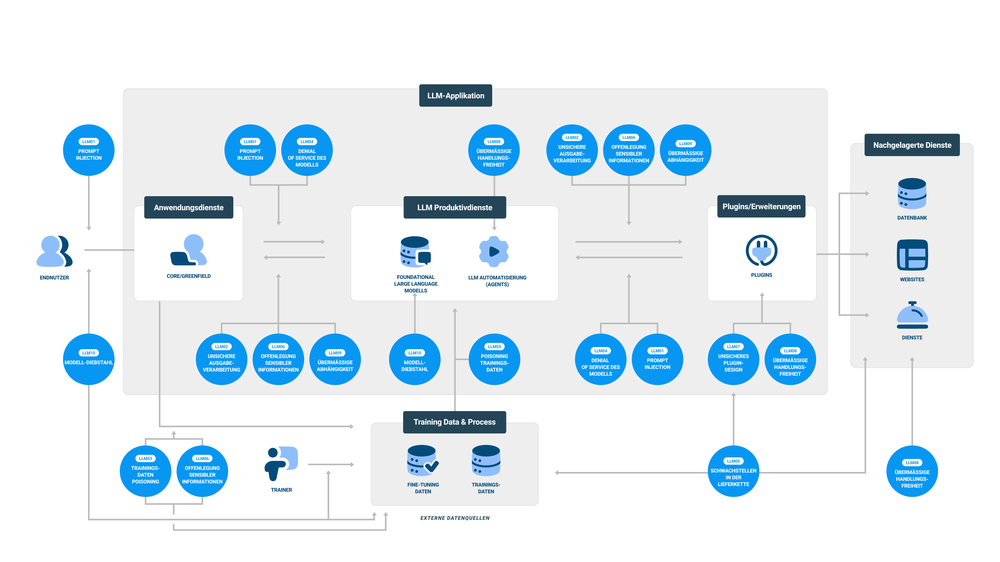

## Übersicht

Jeder Internetnutzer und jedes Unternehmen muss sich auf die kommende Welle leistungsfähiger generativer künstlicher Intelligenz (GenAI) Anwendungen vorbereiten. GenAI verspricht enorme Innovationen, Effizienz und kommerzielle Vorteile in einer Vielzahl von Branchen. Doch wie jede leistungsstarke Technologie in einem frühen Entwicklungsstadium birgt sie ihre eigenen offensichtlichen und unerwarteten Herausforderungen.

Künstliche Intelligenz hat in den letzten 50 Jahren große Fortschritte gemacht und eine Vielzahl von Unternehmensprozessen unauffällig unterstützt, bis das öffentliche Erscheinen von ChatGPT die Entwicklung und Nutzung von Large Language Models (LLMs) sowohl bei Einzelpersonen als auch bei Unternehmen vorangetrieben hat. Anfangs waren diese Technologien auf akademische Studien oder die Ausführung bestimmter, aber wichtiger Aktivitäten innerhalb von Unternehmen beschränkt und nur für wenige Auserwählte sichtbar. Die jüngsten Fortschritte in der Verfügbarkeit von Daten, Computerleistung, GenAI-Fähigkeiten und die Veröffentlichung von Tools wie Llama 2, ElevenLabs und Midjourney haben AI jedoch von einer Nische zu einer allgemein weitverbreiteten Akzeptanz gebracht. Diese Verbesserungen haben nicht nur die GenAI-Technologien zugänglicher gemacht, sondern auch den kritischen Bedarf für Unternehmen hervorgehoben, solide Strategien für die Integration und Nutzung von AI in ihren Geschäftstätigkeiten zu entwickeln, was einen großen Schritt nach vorn in der Art und Weise darstellt, wie wir Technologie nutzen.

Künstliche Intelligenz ist ein breiter Begriff, der alle Bereiche der Informatik umfasst, die es Maschinen ermöglichen, Aufgaben auszuführen, die normalerweise menschliche Intelligenz erfordern würden. Maschinelles Lernen und generative AI sind zwei Unterkategorien von KI.
Maschinelles Lernen ist eine Unterkategorie von KI, die sich auf die Erstellung von Algorithmen konzentriert, die aus Daten lernen können. Maschinelle Lernalgorithmen werden mit einem Datensatz trainiert und können dann diese Daten verwenden, um Vorhersagen oder Entscheidungen über neue Daten zu treffen.
Generative AI ist eine Art von maschinellem Lernen, die sich auf die Erstellung neuer Daten konzentriert. Oftmals stützt sich GenAI auf die Verwendung von Large Language Models, um die erforderlichen Aufgaben zur Erstellung der neuen Daten durchzuführen.
Ein Large Language Model (LLM) ist eine Art von KI-Modell, das menschenähnlichen Text verarbeitet und generiert. Im Kontext der künstlichen Intelligenz bezieht sich ein "Modell" auf ein System, das trainiert wurde, um Vorhersagen basierend auf Eingabedaten zu treffen. LLMs werden speziell auf großen Datensätzen natürlicher Sprache trainiert, daher der Name Large Language Models.

Organisationen betreten Neuland bei der Sicherung und Überwachung von GenAI-Lösungen. Der schnelle Fortschritt von GenAI eröffnet auch Türen für Gegner, ihre Angriffsstrategien zu verbessern und stellt eine doppelte Herausforderung aus Verteidigung und Bedrohungseskalation dar.

Unternehmen verwenden künstliche Intelligenz in vielen Bereichen, einschließlich HR, für  Recruiting, E-Mail-Spam-Filterung, SIEM für Verhaltensanalysen und Managed Detection and Response-Anwendungen. Der Schwerpunkt dieses Dokuments liegt jedoch auf Large Language Model-Anwendungen und ihrer Funktion bei der Erstellung generierter Inhalte.

### Verantwortungsvolle und vertrauenswürdige künstliche Intelligenz

Da Herausforderungen und Vorteile der künstlichen Intelligenz entstehen – und Vorschriften und Gesetze verabschiedet werden – entwickeln sich die Prinzipien und Säulen der verantwortungsvollen und vertrauenswürdigen KI-Nutzung von idealistischen Objekten und Bedenken kommend zu etablierten Standards.

Die OWASP AI Exchange Working Group verfolgt diese Veränderungen und geht die breiteren und herausfordernderen Überlegungen für alle Aspekte der künstlichen Intelligenz an.

Vertrauenswürdige künstliche Intelligenz

ZUVERLÄSSIG
Robust
Verantwortlich
Überwacht
Transparent
Erklärbar

RESILIENT
Sicher
Geschützt
Privat
Effektiv

VERANTWORTUNGSVOLL
Fair
Ethisch
Inklusiv
Nachhaltig
Zweckmäßig

##### Abbildung 1.1 Säulen der vertrauenswürdigen künstlichen Intelligenz
##### erstellt vom Montreal Ethics Institute Beispiel

### Für wen ist dies?

Die OWASP Top 10 für LLM-Anwendungen-Cybersecurity-und-Governance-Checkliste ist für Führungskräfte aus der Exekutive, Technik, Cybersicherheit, Datenschutz, Compliance und Recht, DevSecOps, MLSecOps und Cybersicherheitsteams und Verteidiger gedacht. Sie richtet sich an Personen, die bestrebt sind, in der schnelllebigen KI-Welt einen Schritt voraus zu sein, mit dem Ziel, KI nicht nur für den Unternehmenserfolg zu nutzen, sondern auch gegen die Risiken überstürzter oder unsicherer KI-Implementierungen zu schützen. Diese Führungskräfte und Teams müssen Taktiken entwickeln, um Chancen zu ergreifen, Herausforderungen zu bekämpfen und Risiken zu mindern.

Diese Checkliste soll diesen Technologie- und Geschäftsführern dabei helfen, schnell die Risiken und Vorteile der Nutzung von LLM zu verstehen und sich auf die Entwicklung einer umfassenden Liste kritischer Bereiche und Aufgaben zu konzentrieren, die benötigt werden, um die Organisation zu verteidigen und zu schützen, während sie eine Large Language Model-Strategie entwickeln.

Es ist die Hoffnung des OWASP Top 10 für das LLM-Anwendungen-Teams, dass diese Liste Organisationen helfen wird, ihre bestehenden Verteidigungstechniken zu verbessern und Techniken zu entwickeln, um die neuen Bedrohungen anzugehen, die aus der Nutzung dieser aufregenden Technologie resultieren.

### Warum eine Checkliste?

Checklisten, die zur Formulierung von Strategien verwendet werden, verbessern die Genauigkeit, definieren Ziele, bewahren die Einheitlichkeit und fördern zielgerichtetes, bedachtes Arbeiten, wodurch das Übersehen und Verpassen von Details reduziert werden. Die Nutzung einer Checkliste erhöht nicht nur das Vertrauen in eine sichere Einführung, sondern fördert auch zukünftige Organisationsinnovationen, indem sie eine einfache und effektive Möglichkeit für kontinuierliche Verbesserungen bietet.

### Nicht umfassend

Obwohl dieses Dokument Organisationen dabei unterstützen soll, eine anfängliche LLM-Strategie in einer sich schnell ändernden technischen, rechtlichen und regulatorischen Umgebung zu entwickeln, ist es nicht erschöpfend und deckt nicht jeden Anwendungsfall oder jede Verpflichtung ab. Die Nutzung dieses Dokuments soll Organisationen dazu anregen, Bewertungen und Praktiken über den Umfang der bereitgestellten Checkliste hinaus zu erweitern, wie es für ihren Anwendungsfall oder ihre Zuständigkeit erforderlich ist.

### Die Herausforderungen von Large Language Models

Large Language Models stehen vor mehreren ernsthaften und einzigartigen Problemen. Eines der wichtigsten ist, dass beim Arbeiten mit LLMs die Steuerungs- und Datenebenen nicht strikt isoliert oder trennbar sind. Eine weitere wichtige Herausforderung ist, dass LLMs von Natur aus nichtdeterministisch sind und bei Aufforderung oder Anfrage ein anderes Ergebnis liefern. LLMs verwenden semantische Suche anstelle von Schlüsselwortsuche. Der Kernunterschied zwischen den beiden ist, dass der Algorithmus des Modells die Begriffe in seiner Antwort priorisiert. Dies ist eine bedeutende Abweichung von der Art und Weise, wie Verbraucher bisher Technologie genutzt haben, und es hat Auswirkungen auf die Konsistenz und Zuverlässigkeit der Ergebnisse. Halluzinationen, die aus den Lücken und Trainingsfehlern in den Daten resultieren, auf denen das Modell trainiert wurde, sind das Ergebnis dieser Methode.

Es gibt Methoden, um die Zuverlässigkeit zu verbessern und die Angriffsfläche für Jailbreaking, Modelltäuschungen und Halluzinationen zu reduzieren, aber es gibt einen Kompromiss zwischen Einschränkungen und Nutzen sowohl in Kosten als auch in Funktionalität.

Die Nutzung und Anwendungen von LLM erhöhen die Angriffsfläche einer Organisation. Einige Risiken der Risiken von LLM-Applikationen sind einzigartig, aber viele sind bekannte Probleme, wie die bekannte Software Bill of Materials (SBoM), die Lieferkette, Data Loss Protection (DLP) und unautorisierter Zugriff. Es gibt auch erhöhte Risiken, die nicht direkt mit GenAI zusammenhängen, bei denen GenAI die Effizienz, Fähigkeit und Wirksamkeit von Angreifern, die Organisationen, Einzelpersonen und Regierungssysteme angreifen und bedrohen erhöht.

Gegner nutzen zunehmend LLM- und Generative AI-Tools, um traditionelle Methoden des Angriffs auf Organisationen, Einzelpersonen und Regierungssysteme zu verbessern und zu beschleunigen. LLM verbessert ihre Fähigkeit, Techniken zu verbessern, um mühelos neue Malware zu erstellen, die möglicherweise mit neuartigen Zero-Day-Schwachstellen eingebettet ist oder darauf ausgelegt ist, die Erkennung zu umgehen. Sie können auch ausgeklügelte, einzigartige oder maßgeschneiderte Phishing-Schemata generieren. Die Erstellung überzeugender Deepfakes, sei es Video oder Audio, vereinfacht Social-Engineering. Zusätzlich vereinfachen diese Tools Einbrüche und innovative Hacking-Fähigkeiten zu entwickeln. In Zukunft wird der „maßgeschneiderte“ und kombinierte Einsatz von KI-Technologie durch kriminelle Akteure spezifische Antworten und dedizierte Lösungen für die angemessene Verteidigung und Widerstandsfähigkeit der Organisationen erfordern.

Organisationen gehen auch ein Risiko ein,wenn sie die Fähigkeiten von LLMs NICHT zu nutzen, haben einen Wettbewerbsnachteil. Sie werden auf dem Markt von Kunden und Partnern als veraltet, unfähig zum Skalieren personalisierter Kommunikation wahrgenommen. Ihnen wird Innovationsstagnation, betriebliche Ineffizienz, ein höheres Risiko menschlicher Fehler in Prozessen und ineffiziente Zuweisung von Humanressourcen unterstellt.

Das Verständnis der verschiedenen Arten von Bedrohungen und deren Integration in die Geschäftsstrategie hilft dabei, sowohl die Vor- als auch die Nachteile der Nutzung von Large Language Models (LLMs) gegenüber deren Nichtnutzung abzuwägen und sicherzustellen, dass sie die Geschäftsziele beschleunigen und nicht behindern.

### LLM-Bedrohungskategorien

KI-Bedrohungskarte

Bedrohungen durch NICHT-Nutzung von KI-Modellen
Bedrohungen durch Nutzung von KI-Modellen
Bedrohungen für KI-Modelle
Bedrohungen durch KI-Modelle
KI-rechtliche & regulatorische Bedrohungen

##### Abbildung 1.2 Arten von KI-Bedrohungen
##### credit sdunn

### Schulung zu Sicherheit und Datenschutz in der künstlichen Intelligenz

Mitarbeiter in Organisationen profitieren von Schulungen, um künstliche Intelligenz, generative künstliche Intelligenz und die zukünftigen potenziellen Konsequenzen des Aufbaus, Kaufs oder der Nutzung von LLMs zu verstehen. Schulungen für zulässige Nutzung und Sicherheitsbewusstsein sollten sich sowohl an alle Mitarbeiter richten als auch spezialisierter für bestimmte Positionen wie Personalwesen, Rechtsabteilung, Entwickler, Datenteams und Sicherheitsteams sein.

Richtlinien für faire Nutzung und gesunde Interaktion sind Schlüsselaspekte, die, wenn sie von Anfang an integriert werden, ein Eckpfeiler für den Erfolg zukünftiger KI-Cybersicherheitsbewusstseinskampagnen sein werden. Dies wird den Benutzern das Wissen über die grundlegenden Regeln für die Interaktion sowie die Fähigkeit vermitteln, gutes von schlechtem oder unethischem Verhalten zu unterscheiden.

### Integration von LLM-Sicherheit und -Governance mit bestehenden, etablierten
### Praktiken und Kontrollen

Obwohl KI und generative KI eine neue Dimension zu Cybersicherheit, Resilienz, Datenschutz und der Erfüllung rechtlicher und regulatorischer Anforderungen hinzufügen, sind die lang existierenden bewährten Praktiken immer noch der beste Weg, um Probleme zu identifizieren, Schwachstellen zu finden, diese zu beheben und potenzielle Sicherheitsprobleme zu reduzieren.

● Stellen Sie sicher, dass das Management von KI-Systemen mit bestehenden organisatorischen Praktiken integriert ist.
● Stellen Sie sicher, dass KI/ML-Systeme bestehenden Datenschutz-, Governance- und Sicherheitspraktiken folgen und bei Bedarf spezifische KI-Datenschutz-, Governance- und Sicherheitspraktiken implementiert werden.

### Grundlegende Sicherheitsprinzipien

LLM-Fähigkeiten führen einen anderen Typ von Angriff und Angriffsfläche ein. LLMs sind anfällig für komplexe Geschäftslogikfehler, wie z. B. Prompt-Injektion, unsicheres Plugin-Design und Remote-Code-Ausführung. Existierende Best Practices sind der beste Weg, um diese Probleme zu lösen. Ein internes Produktsicherheitsteam, das sichere Softwareüberprüfung, Architektur, Data-Governance und Drittanbieterbewertungen versteht, muss überprüfen, wie stark die aktuellen Mechanismen sind, um Probleme zu finden, die durch LLM verschlimmert werden könnten, wie z. B. Stimmklonung, Personifizierung oder das Umgehen von Captchas.

Angesichts der jüngsten Fortschritte im maschinellen Lernen, NLP (Natural Language Processing), NLU (Natural Language Understanding), Deep Learning und in jüngerer Zeit LLMs (Large Language Models) und Generative AI wird empfohlen, Fachleute, die in diesen Bereichen versiert sind, bei Cybersicherheits- und Devops-Teams einzubeziehen. Ihre Expertise wird nicht nur bei der Einführung dieser Technologien, sondern auch bei der Entwicklung innovativer Analysen und Antworten auf neu entstehende Herausforderungen helfen.

### Risiko

Der Verweis auf Risiko verwendet die Definition as ISO 31000: Risiko = "Effekt der Unsicherheit auf Ziele." Zu den in der Checkliste enthaltenen LLM-Risiken gehört eine gezielte Liste von LLM-Risiken, die gegnerische, sicherheitstechnische, rechtliche, regulatorische, rufschädigende, finanzielle und wettbewerbliche Risiken ansprechen.

### Schwachstellen- und Minderungstaxonomie

Aktuelle Systeme zur Klassifizierung von Schwachstellen und zum Austausch von Bedrohungsinformationen, wie etwa OVAL, STIX, CVE und CWE, arbeiten noch an der  Fähigkeit, spezifische Schwachstellen und Bedrohungen in Bezug auf große Sprachmodelle (LLMs) und Prediction-Modelle zu überwachen und die Verteidiger zu alarmieren. Es wird erwartet, dass Organisationen sich auf diese etablierten und anerkannten Standards wie CVE für die Klassifizierung von Schwachstellen und STIX für den Austausch von Informationen über Cyber-Bedrohungen (CTI) stützen werden, wenn Schwachstellen oder Bedrohungen für KI/ML-Systeme und deren Lieferketten identifiziert werden.
## Festlegen der LLM-Strategie

Die rasche Expansion von Anwendungen auf Basis großer Sprachmodelle (LLM) hat die Aufmerksamkeit und Untersuchung aller KI/ML-Systeme, die in Geschäftsprozessen verwendet werden, verstärkt. Dies umfasst sowohl Generative KI als auch lang etablierte Vorhersage-KI/ML-Systeme. Diese erhöhte Fokussierung legt potenzielle Risiken offen, wie etwa Angreifer, die Systeme ins Visier nehmen und zuvor übersehen wurden, und Governance- oder rechtliche Herausforderungen, die möglicherweise in Bezug auf rechtliche, Datenschutz-, Haftungs- oder Garantiefragen bislang ignoriert wurden. Für jede Organisation, die KI/ML-Systeme in ihren Abläufen einsetzt, ist es entscheidend, umfassende Richtlinien, Governance, Sicherheitsvorgehen, Datenschutzmaßnahmen und Verantwortungsstandards zu bewerten und zu etablieren, um sicherzustellen, dass diese Technologien bezüglich Sicherheit und Ethik zu den Geschäftsprozessen passen.

Angreifer oder Gegner stellen die unmittelbarste und schädlichste Bedrohung für Unternehmen, Personen und Regierungsbehörden dar. Ihre Ziele, die von finanziellem Gewinn bis hin zu Spionage reichen, treiben sie dazu, kritische Informationen zu stehlen, den Betrieb zu stören und das Vertrauen zu schädigen. Dazu erwerben sie durch KI und maschinelles Lernen die Möglichkeit, mit mehr Geschwindigkeit und Raffinesse den Verteidigern voraus zu sein.

Die dringendste Nicht-Gegner-LLM-Bedrohung für viele Organisationen stammt von "Shadow AI": Mitarbeiter, die nicht genehmigte Online-KI-Tools, unsichere Browser-Plugins und Drittanbieteranwendungen verwenden, die LLM-Funktionen durch Updates oder Upgrades einführen und damit standardisierte Softwaregenehmigungsprozesse umgehen.

Bereitstellung

Schritt 1: Resilienz-Strategie zuerst

▶ Identifikation unmittelbarer Bedrohungen durch Bedrohungsmodellierung von Missbrauchsfällen
▶ Überprüfen Sie interne oder externe Ausnutzungsmöglichkeiten in den Bedrohungsmodellszenarien und verifizieren Sie Sicherheitsmaßnahmen
▶ Scannen und überwachen Sie Ihr Environment auf Vorkommen von Schadsoftware

Schritt 2: Bestehende Richtlinien aktualisieren

▶ Verträge, Geheimhaltungsvereinbarungen, Governance und Sicherheit prüfen, um bei Bedarf Nutzung und Bedrohung durch LLMs oder GenAI zu integrieren

Schritt 3: Schulung / Bildung

▶ Aktualisieren Sie das Sicherheitsbewusstseinstraining, Entwickler-, rechtliche oder andere Schulungen, um die Nutzung oder Bedrohung durch LLMs oder GenAI einzubeziehen

Schritt 4: Führungskräfte einbeziehen

▶ Arbeiten Sie mit Führungskräften und anderen Stakeholdern zusammen, um LLM- oder GenAI-Lösungsstrategien zu identifizieren
▶ Implementieren Sie eine Risikomanagementstrategie

Schritt 5: Aktualisieren Sie Ihr Programm zur Risikomanagement bei Drittanbietern

▶ Lösungen von Drittanbietern und Anbietern für KI benötigen erweiterte Fragebögen und Überprüfungen

Schritt 6: Eine Bereitstellungsstrategie wählen

##### Abbildung 2.1 Optionen für Bereitstellungsstrategie
##### Quelle: sdunn

### Bereitstellungsstrategie

Die Bandbreite reicht von der Nutzung öffentlicher Endverbraucheranwendungen bis hin zum Training proprietärer Modelle auf eigenen Daten. Faktoren wie Sensibilität der Anwendungsfälle, benötigte Fähigkeiten und verfügbare Ressourcen helfen dabei, das passende Gleichgewicht zwischen Komfort und Kontrolle zu bestimmen. Das Verständnis dieser fünf Modelltypen bietet dabei einen Rahmen für die Bewertung der Optionen.

Bereitstellungstypen

Typ 1: Direkter Zugriff

▶ Große Sprachmodelle über eine Schnittstelle nutzen
▶ Risiko durch Unternehmensrichtlinien und Mitarbeitertraining mindern
▶ Vorteile: Flexibles und schnelles Experimentieren
▶ Beispiele: Perplexity, ChatGPT, big-AGI

Typ 2: Zugriff über Model API

▶ Große Sprachmodelle direkt von Anbietern über deren API nutzen
▶ Risiko mit Unternehmensrichtlinien und Mitarbeitertraining mindern
▶ Vorteile: Schnelles Experimentieren mit etwas zentraler Kontrolle über die API
▶ Beispiele: Claude, ChatGPT, Gemini

Typ 3: Lizenzmodell

▶ Ein lizenziertes großes Sprachmodell auf den eigenen Systemen betrieben
▶ Risiko durch Verwaltung durch Eigenbetrieb mindern. Risiko durch Unternehmensrichtlinien und Mitarbeitertraining reduzieren
▶ Vorteile: mehr Kontrolle und Integration durch internen Tools und Workflows
▶ Beispiele: Microsoft Enterprise CoPilot, Amazon Codewhisperer, SalesForce Einstein GPT

Typ 4: Vortrainiertes Modell

▶ Ein allgemeines Basismodell nutzen, dann durch Finetuning mit Unternehmens- oder benutzerdefinierten Daten anpassen
▶ Risiko mit erhöhter Transparenz mindern, Leistung verbessern, Halluzinationen reduzieren. Risiko mit Unternehmensrichtlinien und Mitarbeitertraining reduzieren
▶ Vorteile: Verbesserte Leistung und reduzierte Halluzinationen
▶ Beispiele: QwenLM/Qwen 1.5, DBRX, Starling 7B

Typ 5: Bewährtes Modell finetunen

▶ Bewährte (spezialisierte) Modelle nutzen und weiter mit eigenen Daten feinabstimmen, um sie an Ihr Unternehmen anzupassen
▶ Risiko mit erhöhter Transparenz mindern, Leistung verbessern, Halluzinationen reduzieren. Risiko mit Unternehmensrichtlinien und Mitarbeitertraining reduzieren
▶ Vorteile: Ermöglicht Anpassung über vortrainierte Modelle hinaus
▶ Beispiele: Google MedPalm, Amazon Bedrock, Llama2, LegalAI

Typ 6: Individuelle Modelle

▶ Eine maßgeschneiderte KI/ML-Modellarchitektur für spezifische Unternehmensanwendungsfälle bauen
▶ Risiko mit vollständiger Sichtbarkeit und Kontrolle mindern. Risiko mit Unternehmensrichtlinien, Entwickler- und Mitarbeitertraining reduzieren
▶ Vorteile: Erfordert große Investitionen, maximiert aber die Anpassbarkeit

##### Abbildung 2.2 Optionen für Bereitstellungstypen
##### Quelle: sdunn
## Checkliste

### Risiko durch Gegner

Das Risiko durch Gegner enthält sowohl Konkurrenten als auch Angreifer.

Untersuchen Sie, wie Konkurrenten in künstliche Intelligenz investieren. Obwohl es Risiken bei der Einführung von KI gibt, gibt es auch geschäftliche Vorteile, die zukünftige Marktpositionen beeinflussen können.
Untersuchen Sie die Auswirkungen auf aktueller Kontrollmechanismen, wie etwa Passwortzurücksetzungen über Spracherkennung, die möglicherweise nicht mehr die angemessene Abwehr gegen neue von GenAI verstärkte Angriffe bieten.
Aktualisieren Sie den Incident-Response-Plan und die Playbooks für von GenAI verstärkte Angriffe und spezifische Vorfälle in Bezug auf KI/ML.

### Bedrohungsmodellierung

Bedrohungsmodellierung wird dringend empfohlen, um Bedrohungen zu identifizieren, Prozesse und Sicherheitsverteidigungen zu untersuchen. Bedrohungsmodellierung ist eine Reihe systematischer, wiederholbarer Vorgehensweisen, die es ermöglichen, angemessene Sicherheitsentscheidungen für Anwendungen, Software und Systeme zu treffen. Bedrohungsmodellierung für durch GenAI beschleunigte Angriffe vor dem Einsatz von LLMs ist der kosteneffektivste Weg, um Risiken zu identifizieren und zu mindern, Daten und Privatsphäre zu schützen und eine sichere, konforme Integration in die Geschäftsabläufe zu gewährleisten.

Wie werden Gegner Angriffe gegen die Organisation, Mitarbeiter, Führungskräfte oder Nutzer beschleunigen? Organisationen sollten "hyper-personalisierte" Angriffe in großem Maßstab mit generativer KI erwarten. LLM-unterstützte Spear-Phishing-Angriffe sind jetzt exponentiell effektiver, gezielter und besser für einen Angriff ausgerüstet.
Wie könnte GenAI für Angriffe auf die Kunden oder Klienten des Geschäfts durch Fälschung oder von GenAI generierte Inhalte verwendet werden?
Kann die Organisation schädliche oder bösartige Eingaben oder Anfragen an LLM-Lösungen erkennen und neutralisieren?
Kann die Organisation Verbindungen mit bestehenden Systemen und Datenbanken mit sicheren Integrationen an allen Vertrauensgrenzen der LLMs schützen?
Verfügt die Organisation über Maßnahmen zur Minderung von Insider-Bedrohungen, um Missbrauch durch autorisierte Benutzer zu verhindern?
Kann die Organisation unbefugten Zugriff auf proprietäre Modelle oder Daten verhindern, um geistiges Eigentum zu schützen?
Kann die Organisation die Erzeugung von schädlichen oder unangemessenen Inhalten mit automatischer Inhaltsfilterung verhindern?

### KI-Asset-Inventar

Ein KI-Asset-Inventar sollte sowohl für intern entwickelte als auch für externe oder Drittanbieterlösungen gelten.

Katalogisieren Sie bestehende KI-Dienste, Tools und deren Eigentümer. Weisen Sie eine Kennzeichnung im Asset-Management für spezifische Inventare zu.
Schließen Sie KI-Komponenten in die Software Bill of Material (SBOM) ein, eine umfassende Liste aller Softwarekomponenten, Abhängigkeiten und Metadaten, die mit Anwendungen verbunden sind.
Katalogisieren Sie KI-Datenquellen und die Sensibilität der Daten (geschützt, vertraulich, öffentlich)
Stellen Sie fest, ob Pen-Tests oder Red-Teaming für eingesetzten KI-Lösungen erforderlich sind, um das aktuelle Angriffsrisiko zu bestimmen.
Erstellen Sie einen Onboarding-Prozess für KI-Lösungen.
Stellen Sie sicher, dass qualifiziertes IT-Admin-Personal entweder intern oder extern verfügbar ist, gemäß den Anforderungen aus der SBOM.

### KI-Sicherheits- und Datenschutzschulung

Engagieren Sie sich aktiv mit Mitarbeitern, um Bedenken bezüglich geplanter LLM-Initiativen zu verstehen und anzugehen.
Etablieren Sie eine Kultur offener und transparenter Kommunikation über den Einsatz von vorhersagender oder generativer KI innerhalb der Organisationsprozesse, Systeme, Mitarbeitermanagement und -unterstützung sowie Kundenengagements und wie deren Einsatz geregelt, verwaltet und deren Risiken angegangen werden.
Schulen Sie alle Benutzer in Ethik, Verantwortung und rechtlichen Fragen wie Garantie, Lizenz und Urheberrecht.
Aktualisieren Sie das Security-Awareness-Training, um GenAI-bezogene Bedrohungen wie Stimmklonung und Bildklonung und die Erwartung erhöhter Spear-Phishing-Angriffe einzuschließen.
Jede eingeführte GenAI-Lösung sollte Schulungen sowohl für DevOps als auch für Cybersicherheit für die Bereitstellungspipeline umfassen, um KI-Sicherheit und -Sicherheitszusagen zu gewährleisten.

### Business-Cases etablieren

Solide Business-Cases sind wesentlich, um den Geschäftswert jeder vorgeschlagenen KI-Lösung zu bestimmen, Risiko und Nutzen abzuwägen sowie die Rendite von Investitionen zu bewerten und zu testen. Es gibt eine enorme Anzahl potenzieller Anwendungsfälle:

Verbesserung der Kundenerfahrung
Verbesserte betriebliche Effizienz
Besseres Wissensmanagement
Verbesserte Innovation
Marktforschung und Konkurrenzanalyse
Dokumentenerstellung, Übersetzung, Zusammenfassung und Analyse

### Governance

Corporate Governance wird bei LLMs notwendig, um Organisationen Transparenz und Rechenschaftsfähigkeit zu bieten. Die Identifizierung von KI-Plattform- oder Prozesseigentümern, die möglicherweise mit der Technologie oder den ausgewählten Anwendungsfällen für das Geschäft vertraut sind, ist nicht nur ratsam, sondern auch notwendig, um eine ausreichende Reaktionsgeschwindigkeit zu gewährleisten, die Kollateralschäden an gut etablierten digitalen Unternehmensprozessen verhindert.

Etablieren Sie ein KI-RACI-Diagramm der Organisation (wer ist verantwortlich, wer ist rechenschaftspflichtig, wer sollte konsultiert und wer sollte informiert werden)
Dokumentieren und ordnen Sie KI-Risiko, Risikobewertungen und Governance-Verantwortung innerhalb der Organisation zu.
Etablieren Sie Datenmanagementrichtlinien bezüglich Datenklassifizierung und Nutzungseinschränkungen, einschließlich ihrer technischer Durchsetzung. Modelle sollten nur Daten nutzen, die für das Mindestzugriffsniveau eines Benutzers des Systems klassifiziert sind. Aktualisieren Sie zum Beispiel die Datenschutzrichtlinie, damit keine geschützten oder vertraulichen Daten in nicht geschäftlich verwaltete Tools eingegeben werden.
Erstellen Sie eine KI-Richtlinie, die durch etablierte Richtlinien unterstützt wird (z. B. Standard guter Führung, Datenschutz, Softwarenutzung)
Veröffentlichen Sie eine Matrix akzeptierbarer Nutzung für die verschiedenen generativen KI-Tools für Ihre Mitarbeiter.
Dokumentieren Sie die Quellen und das Management aller Daten, die die Organisation von generativen LLM-Modellen verwendet.

### Rechtlich

Viele der rechtlichen Implikationen von KI sind undefiniert und potenziell sehr kostspielig. Eine Partnerschaft von IT-, Sicherheits- und Legal ist entscheidend, um Lücken zu identifizieren und ungeklärte Entscheidungen anzugehen.

Stellen Sie sicher, dass Produktgarantien im Produktentwicklungsfluß klar zugewiesen sind, um festzulegen, wer für Produktgarantien mit KI verantwortlich ist.
Überprüfen und aktualisieren Sie bestehende Geschäftsbedingungen für jegliche GenAI-Überlegungen.
Überprüfen Sie KI-Endbenutzer-Lizenzvereinbarungen. Endbenutzer-Lizenzvereinbarungen für GenAI-Plattformen unterscheiden sich sehr darin, wie sie Benutzeraufforderungen, Ausgaberechte und -eigentum, Datenschutz, Compliance, Haftung, Privatsphäre und Einschränkungen bezüglich der Nutzung von Ausgaben handhaben.
Passen Sie den Endbenutzer-Lizenzvertrag der Organisation für Kunden an, um zu verhindern, dass die Organisation Haftungen im Zusammenhang mit Plagiaten, Bias-Verbreitung oder Verletzung des geistigen Eigentums durch KI-generierte Inhalte übernimmt.
Prüfen Sie bestehende KI-unterstützte Tools, die für die Codeentwicklung verwendet werden. Die Fähigkeit eines Chatbots, Code zu schreiben, kann die Eigentumsrechte eines Unternehmens an seinem Produkt gefährden. Zum Beispiel könnte dies den Status und Schutz des generierten Inhalts und die Rechte, diesen generierten Inhalt zu nutzen, in Frage stellen.
Prüfen Sie alle Risiken für das geistige Eigentum. Geistiges Eigentum, das von einem Chatbot generiert wurde, könnte gefährdet sein, wenn während des generativen Prozesses unrechtmäßig erhaltene Daten verwendet wurden, die urheberrechtlich, markenrechtlich oder patentrechtlich geschützt sind. Wenn die KI-Produkte rechtswidriges Material verwenden, entsteht ein Risiko für die Erzeugnisse der KI, was zu einer Verletzung des geistigen Eigentums führen kann.
Überprüfen Sie Verträge mit Freistellungsklauseln. Freistellungsklauseln versuchen, die Verantwortung für ein Ereignis, das zu einer Haftung führt, auf die Person zu legen, die dafür am meisten verantwortlich war oder die beste Chance hatte, es zu verhindern. Etablieren Sie Leitplanken, um zu bestimmen, ob der Anbieter der KI oder ihr Benutzer das Ereignis verursacht hat, das zur Haftung führt.
Überprüfen Sie die Haftung für mögliche Verletzungen und Sachschäden, die durch KI-Systeme verursacht werden.
Überprüfen Sie die Versicherungsdeckung. Traditionelle Haftpflicht- oder gewerbliche allgemeine Haftpflichtversicherungen sind wahrscheinlich unzureichend, um den Einsatz von KI vollständig abzusichern.
Identifizieren Sie jegliche Urheberrechtsfragen. Für das Urheberrecht ist menschliche Urheberschaft erforderlich. Eine Organisation kann auch für Plagiate, Bias-Verbreitung oder Verletzung des geistigen Eigentums haftbar gemacht werden, wenn LLM-Tools missbräuchlich verwendet werden.
Stellen Sie sicher, dass Vereinbarungen für Auftragnehmer und die angemessene Nutzung von KI für Entwicklungen oder bereitgestellte Dienste vorhanden sind.
Beschränken oder verbieten Sie die Nutzung von generativen KI-Tools für Mitarbeiter oder Auftragnehmer, bei denen durchsetzbare Rechte ein Problem sein könnten oder bei denen Bedenken hinsichtlich der Verletzung des geistigen Eigentums bestehen.
Prüfen Sie die KI-Lösungen, die für das Mitarbeitermanagement oder die Einstellung verwendet werden. Diese könnten zu Ansprüchen wegen unterschiedlicher Behandlung führen.
Stellen Sie sicher, dass die KI-Lösungen keine sensiblen Informationen ohne ordnungsgemäße Zustimmung oder Autorisierung sammeln oder teilen.

### Regulierung

Der KI-Akt der EU wird voraussichtlich das erste umfassende KI-Gesetz sein, wird aber frühestens 2025 gelten. Die Datenschutz-Grundverordnung (DSGVO) der EU adressiert KI nicht spezifisch, beinhaltet jedoch Regeln für die Datenerhebung, Datensicherheit, Fairness und Transparenz, Genauigkeit und Zuverlässigkeit sowie Rechenschaftspflicht, die den Einsatz von GenAI beeinflussen können. In den Vereinigten Staaten ist die KI-Regulierung in breitere Verbraucherdatenschutzgesetze eingebettet. Zehn US-Bundesstaaten haben Gesetze verabschiedet oder haben Gesetze, die bis Ende 2023 in Kraft treten werden.

Kanada hat bisher nur einen freiwilligen Verhaltenskodex zur verantwortungsvollen Entwicklung und Verwaltung fortgeschrittener generativer KI-Systeme veröffentlicht, jedoch wird der Artificial Intelligence and Data Act (AIDA) strengere Anforderungen haben.

Bundesorganisationen wie die US Equal Employment Opportunity Commission (EEOC), das Consumer Financial Protection Bureau (CFPB), die Federal Trade Commission (FTC) und die Civil Rights Division des US-Justizministeriums (DOJ) überwachen die Fairness im Recruiting genau.

Ermitteln Sie länderspezifische, staatliche oder andere staatliche KI-Compliance-Anforderungen.
Ermitteln Sie Compliance-Anforderungen für die Einschränkung der elektronischen Überwachung von Mitarbeitern und beschäftigungsbezogenen automatisierten Entscheidungssystemen (Vermont, Kalifornien, Maryland, New York, New Jersey)
Ermitteln Sie Compliance-Anforderungen für die Zustimmung zur Gesichtserkennung und AI-biasierter Videoanalyse.
Überprüfen Sie KI-Tools, die für die Einstellung oder Verwaltung von Mitarbeitern verwendet werden oder in Betracht gezogen werden.
Bestätigen Sie die Einhaltung der anwendbaren KI-Gesetze und Best Practices durch den Anbieter.
Ermitteln und dokumentieren Sie alle Produkte, die KI während des Einstellungsprozesses verwenden. Fragen Sie, wie das Modell trainiert wurde, wie es überwacht wird und verfolgen Sie alle Korrekturen, um Diskriminierung und Bias zu vermeiden.
Ermitteln und dokumentieren Sie, welche Unterkunftsoptionen enthalten sind.
Ermitteln und dokumentieren Sie, ob der Anbieter vertrauliche Daten sammelt.
Ermitteln Sie, wie der Anbieter oder das Tool Daten speichert und löscht und die Nutzung von Gesichtserkennung und Videoanalysetools während der Vorbeschäftigung regelt.
Überprüfen Sie andere organisationsspezifische regulatorische Anforderungen mit KI, die Compliance-Probleme aufwerfen könnten. Der Employee Retirement Income Security Act von 1974 hat zum Beispiel treuhänderische Pflichtanforderungen für Rentenpläne, die ein Chatbot möglicherweise nicht erfüllen kann.

### Einsatz oder Implementierung von Large Language Model-Lösungen

Erstellen Sie ein Bedrohungsmodell für LLM-Komponenten und Architekturvertrauensgrenzen.
Datensicherheit, überprüfen Sie, wie Daten basierend auf Sensibilität klassifiziert und geschützt werden, einschließlich persönlicher und proprietärer Geschäftsdaten. (Wie werden Benutzerberechtigungen verwaltet und welche Schutzmaßnahmen sind vorhanden?)
Zugangskontrolle, implementieren Sie Zugangskontrollen mit minimalen Rechten und setzen Sie Verteidigungsmaßnahmen in der Tiefe um.
Sicherheit der Trainingspipeline, sichern Sie strenge Kontrolle für Trainingsdaten-Governance, Pipelines, Modelle und Algorithmen.
Sicherheit von Eingaben und Ausgaben, prüfen Sie Methoden zur Eingabevalidierung sowie wie Ausgaben gefiltert, bereinigt und genehmigt werden.
Monitoring and Response, dokumentieren Sie Workflows, Überwachung und Reaktionen, um Automatisierung, Protokollierung und Auditing nachvollziehen zu können. Stellen Sie sicher, dass Prüfprotokolle gesichert sind.
Integrieren Sie Anwendungstests, Quellcodeüberprüfungen, Schwachstellenbewertungen und Red-Teaming in den Produktionsfreigabeprozess.
Überprüfen Sie auf bestehende Schwachstellen im LLM-Modell oder in der Lieferkette.
Untersuchen Sie die Auswirkungen von Bedrohungen und Angriffen auf LLM-Lösungen, wie Prompt-Injektion, die Freigabe sensibler Informationen oder Prozessmanipulation.
Untersuchen Sie die Auswirkungen von Angriffen und Bedrohungen auf LLM-Modelle, einschließlich Model-Poisoning, unsachgemäßem Datenhandling, Angriffen auf die Lieferkette und Modell-Diebstahl.
Sicherheit der Lieferkette, fordern Sie Drittprüfungen, Penetrationstests und Codeüberprüfungen für Drittanbieter an. (sowohl initial als auch fortlaufend)
Infrastruktursicherheit, fragen Sie, wie oft ein Anbieter Resilienztests durchführt? Was sind die SLAs in Bezug auf Verfügbarkeit, Skalierbarkeit und Performance?
Aktualisieren Sie die Einsatzpläne für Incident Response und beziehen Sie Zwischenfälle mit großen Sprachmodellen (LLMs) in Tabletop-Übungen mit ein.
Identifizieren Sie oder erweitern Sie Metriken, um generative Cybersicherheits-KI mit anderen Ansätzen zu vergleichen, um die erwarteten Produktivitätssteigerungen zu messen.

### Testen, Evaluieren, Verifizieren und Validieren (TEVV)

Das NIST AI Framework empfiehlt einen kontinuierlichen TEVV-Prozess während des gesamten Lebenszyklus der KI, der die Betreiber der KI-Systeme, Fachexperten, KI-Designer, Benutzer, Produktentwickler, Evaluatoren und Prüfer einschließt. TEVV umfasst eine Reihe von Aufgaben wie Systemvalidierung, Integration, Testen, Neukalibrierung und fortlaufendes Monitoring für periodische Updates, um mit den Risiken und Veränderungen des KI-Systems umzugehen.

Etablieren Sie kontinuierliches Testen, Evaluieren, Verifizieren und Validieren während des gesamten Lebenszyklus des KI-Modells.
Stellen Sie regelmäßig Führungsmetriken und Updates zur Funktionalität, Sicherheit, Zuverlässigkeit und Robustheit des KI-Modells bereit.

### Modellkarten und Risikokarten

Modellkarten und Risikokarten sind grundlegende Elemente, um die Transparenz, Rechenschaftspflicht und ethische Bereitstellung von großen Sprachmodellen (LLMs) zu erhöhen. Modellkarten helfen Benutzern, KI-Systeme zu verstehen und zu vertrauen, indem sie standardisierte Dokumentationen über deren Design, Fähigkeiten und Einschränkungen bereitstellen, was zu fundierten und sicheren Anwendungen führt. Risikokarten ergänzen dies, indem sie offen potenzielle negative Konsequenzen ansprechen, wie Vorurteile, Datenschutzprobleme und Sicherheitsanfälligkeiten, was einen proaktiven Ansatz zur Schadensprävention fördert. Diese Dokumente sind für Entwickler, Benutzer, Regulierungsbehörden und Ethiker gleichermaßen wichtig, da sie eine kooperative Atmosphäre schaffen, in der die sozialen Auswirkungen von KI sorgfältig behandelt und gehandhabt werden. Diese Karten, die von den Organisationen entwickelt und gepflegt werden, die die Modelle erstellt haben, spielen eine wichtige Rolle dabei, sicherzustellen, dass KI-Technologien ethische Standards und gesetzliche Anforderungen erfüllen, was eine verantwortungsbewusste Forschung und Bereitstellung im KI-Ökosystem ermöglicht.

Modellkarten enthalten wichtige Attribute, die mit dem ML-Modell verbunden sind:

Modellangaben: Grundlegende Informationen über das Modell, z. B. Name, Version und Typ (Neuronales Netzwerk, Entscheidungsbaum usw.) und der vorgesehene Anwendungsfall.
Modellarchitektur: Enthält eine Beschreibung der Struktur des Modells, wie die Anzahl und Art der Schichten, Aktivierungsfunktionen und andere wichtige architektonische Entscheidungen.
Trainingsdaten und Methodik: Informationen über die Daten, die zum Trainieren des Modells verwendet wurden, wie die Größe des Datensatzes, die Datenquellen und etwaige Vorverarbeitungs- oder Datenanreicherungstechniken. Es enthält auch Details zur Trainingsmethodik, wie den verwendeten Optimierer, die Verlustfunktion und etwaige eingestellte Hyperparameter.
Leistungsmetriken: Informationen über die Leistung des Modells anhand verschiedener Metriken, wie Genauigkeit, Präzision, Rückruf und F1-Score. Es kann auch Informationen darüber enthalten, wie das Modell bei verschiedenen Datensubsets abschneidet.
Potenzielle Vorurteile(Bias) und Einschränkungen: Listen potenzieller Vorurteile(Bias) oder Einschränkungen des Modells auf, wie unausgeglichene Trainingsdaten, Überanpassung oder Vorurteile in den Vorhersagen des Modells. Es kann auch Informationen über die Einschränkungen des Modells enthalten, wie seine Fähigkeit, sich auf neue Daten zu generalisieren oder seine Eignung für bestimmte Anwendungsfälle.
Überlegungen zu verantwortungsvoller KI: Alle ethischen oder verantwortungsvollen KI-Überlegungen im Zusammenhang mit dem Modell, wie Datenschutzbedenken, Fairness und Transparenz oder mögliche gesellschaftliche Auswirkungen der Nutzung des Modells. Es kann auch Empfehlungen für weitere Tests, Validierungen oder Überwachungen des Modells enthalten.

Die genauen Merkmale, die in einer Modellkarte enthalten sind, können je nach Kontext und beabsichtigter Verwendung des Modells variieren, aber das Ziel ist es, Offenheit und Rechenschaftspflicht in der Entwicklung und Bereitstellung von maschinellen Lernmodellen zu bieten.

Prüfen Sie eine Modellkarte des Modells
Prüfen Sie eine Risikokarte, falls verfügbar
Etablieren Sie einen Prozess zur Überwachung und Pflege von Modellkarten für jedes bereitgestellte Modell, einschließlich Modelle, die durch Dritte verwendet werden.

### RAG: Optimierung von großen Sprachmodellen

Fine-Tuning, die traditionelle Methode zur Optimierung eines vortrainierten Modells, beinhaltete das erneute Training eines vorhandenen Modells mit neuen, domänenspezifischen Daten, um es für eine Aufgabe oder Anwendung zu modifizieren. Fine-Tuning ist teuer, aber wesentlich zur Leistungsverbesserung.

Retrieval-Augmented Generation (RAG) hat sich als eine effektivere Methode zur Optimierung und Erweiterung der Fähigkeiten von großen Sprachmodellen entwickelt, indem relevante Daten aus aktuellen verfügbaren Wissensquellen abgerufen werden. RAG kann für spezifische Domänen angepasst werden, um die Abfrage domänenspezifischer Informationen zu optimieren und den Generierungsprozess auf die Nuancen spezialisierter Bereiche zuzuschneiden. RAG wird als eine effizientere und transparentere Methode zur Optimierung von LLM angesehen, insbesondere für Probleme, bei denen markierte Daten begrenzt oder teuer zu sammeln sind. Einer der Hauptvorteile von RAG ist die Unterstützung kontinuierlichen Lernens, da neue Informationen kontinuierlich auf der Abrufstufe aktualisiert werden können.

Die Implementierung von RAG umfasst mehrere wichtige Schritte, beginnend mit dem Einsatz des Einbettungsmodells, dem Indizieren der Wissensbibliothek bis hin zum Abrufen der relevantesten Dokumente für die Verarbeitung von Anfragen. Effizientes Abrufen des relevanten Kontexts wird basierend auf Vektordatenbanken durchgeführt, die zur Speicherung und Abfrage von Dokumenteinbettungen verwendet werden.

#### RAG-Referenz
Retrieval Augmented Generation (RAG) & LLM: Examples
12 RAG Pain Points and Proposed Solutions

### AI Red Teaming

AI Red Teaming ist eine simulierte Angriffstestsimulation des KI-Systems, um zu validieren, dass keine vorhandenen Schwachstellen ausgenutzt werden können. Es ist eine von vielen regulatorischen und KI-regulierenden Organisationen empfohlene Praxis, einschließlich der Biden-Administration. Red Teaming allein ist jedoch keine umfassende Lösung zur Validierung aller realen Schäden, die mit KI-Systemen verbunden sind, und sollte mit anderen Formen von Testen, Evaluieren, Verifizieren und Validieren wie algorithmischen Auswirkungsbewertungen und externen Audits kombiniert werden.

Integrieren Sie Red Team-Tests als Standardpraxis für KI-Modelle und Anwendungen.
## Ressourcen

OWASP Top 10 für Large Language Models

LLM01: Prompt Injection (Prompt-Einschleusung)
Mit raffinierten Eingabenkann man ein Large Language Model manipulieren und unbeabsichtigte Aktionen verursachen. Direkte Injections überschreiben System-Prompts, während indirekte Eingaben von externen Quellen manipuliert werden.

LLM02: Unsichere Ausgabeverarbeitung
Diese Schwachstelle tritt auf, wenn eine Ausgabe von einem LLM ohne Überprüfung akzeptiert wird, und damit Backend-Systeme angreifbar macht. Missbrauch kann zu schwerwiegenden Konsequenzen wie XSS (Cross-Site Scripting), CSRF (Cross-Site Request Forgery), SSRF (Server Side Request Forgery), Privilegienerweiterung oder Remote-Code-Ausführung führen.

LLM03: Poisoning der Trainingsdaten
Dies tritt auf, wenn LLM-Trainingsdaten manipuliert werden, wodurch Sicherheitslücken oder Bias entstehen, die die Sicherheit, Wirksamkeit oder ethisches Verhalten beeinträchtigen. Quellen umfassen Common Crawl, WebText, OpenWebText und Bücher.

LLM04: Denial of Service des Modells
Angreifer verursachen ressourcenintensive Operationen auf Large Language Models, was zu Servicedegradierung oder hohen Kosten führt. Die Schwachstelle wird durch die ressourcenintensive Natur der LLMs und die Unvorhersehbarkeit der Benutzereingaben vergrößert.

LLM05: Schwachstellen in der Supply Chain
Der Lifecycle von LLM-Anwendungen kann durch anfällige Komponenten oder Dienste beeinträchtigt werden, was zu Sicherheitsangriffen führt. Die Verwendung von Drittanbieterdatensätzen, vortrainierten Modellen und Plugins kann Schwachstellen hinzufügen.

LLM06: Offenlegung sensibler Informationen
LLMs können in ihren Antworten vertrauliche Daten preisgeben, was zu unbefugtem Datenzugriff, Datenschutzverletzungen und Sicherheitsbrüchen führt. Es ist entscheidend, Datenbereinigung und strenge Benutzerrichtlinien zu implementieren, um dies zu reduzieren.

LLM07: Unsicheres Plugin-Design
LLM-Plugins können unsichere Eingaben und unzureichende Zugriffskontrollen haben. Dieser Mangel an Anwendungskontrolle macht sie leichter ausnutzbar und kann zu Konsequenzen wie der Ausführung von Remote-Code führen.

LLM08: Übermäßige Handlungsfreiheit
LLM-basierte Systeme können Handlungen durchführen, die zu unbeabsichtigten Konsequenzen führen. Das Problem entsteht durch übermäßige Funktionalität, Berechtigungen oder Autonomie, die den LLM-basierten Systemen gewährt wird.

LLM09: Übermäßige Abhängigkeit
Systeme oder Personen, die sich übermäßig auf LLMs verlassen, ohne angemessene Kontrolle, können Fehlinformationen, Misskommunikation, rechtliche Probleme und Sicherheitslücken aufgrund von falschen oder unangemessenen von den LLMs generierten Inhalten gegenüberstehen.

LLM10: Modell-Diebstahl
Dies umfasst unbefugten Zugriff, Kopieren oder Exfiltration von proprietären LLM-Modellen. Die Auswirkungen umfassen wirtschaftliche Verluste, beeinträchtigte Wettbewerbsvorteile und potenziellen Zugang zu sensiblen Informationen.

##### Figure 4.1  OWASP Top 10 for Large Language Model Applications

##### Abbildung 4.2 OWASP Top 10 für Large-Language-Model-Anwendungen visualisiert

### OWASP-Ressourcen

Die Verwendung von LLM-Lösungen erweitert die Angriffsfläche einer Organisation und stellt neue Herausforderungen dar, die spezielle Taktiken und Verteidigungen erfordern. Es enthält auch Probleme, die analog zu bekannten Problemen sind, für die bereits etablierte Cybersecurity-Verfahren und Milderungsmaßnahmen existieren. Die Integration der LLM-Cybersicherheit in die etablierten Cybersicherheitskontrollen, -prozesse und -verfahren einer Organisation ermöglicht es einer Organisation, ihre Anfälligkeit für Bedrohungen zu verringern.
Wie sie integriert werden, ist verfügbar unter den OWASP-Integrationsstandards.

#### OWASP-Ressource
OWASP SAMM
#### Beschreibung
Software Assurance Maturity Model
#### Warum es empfohlen wird & Wo es verwendet wird
Es bietet eine effektive und messbare Möglichkeit, die sichere Entwicklung eines Unternehmens zu analysieren und zu verbessern. SAMM unterstützt den kompletten Software-Lebenszyklus. Es ist iterativ und risikobasiert, ermöglicht Unternehmen, Lücken in der sicheren Softwareentwicklung zu identifizieren und zu priorisieren, damit Ressourcen für die Verbesserung des Prozesses dort eingesetzt werden können, wo die Bemühungen den größten Verbesserungseffekt haben.

#### OWASP-Ressource
OWASP AI Exchange
OWASP Machine Learning Security Top 10
#### Beschreibung
OWASP-Projekt zum weltweiten Austausch über AI-Sicherheit, Förderung der Standardausrichtung und Antrieb der Zusammenarbeit.
OWASP AI Exchange ist die Eingabemethode für den OWASP AI Security and Privacy Guide
OWASP Machine Learning Security Top 10 Sicherheitsprobleme von maschinellen Lernsystemen
#### Warum es empfohlen wird & wo es verwendet wird
Dieses Projekt umfasst die ML Top 10 und ist ein lebendiges Arbeitsdokument, das klare und handlungsorientierte Einblicke in das Entwerfen, Erstellen, Testen und Beschaffen von sicheren und datenschutzorientierten AI-Systemen bietet. Es ist die beste OWASP-Ressource für globale regulatorische und Datenschutzinformationen zu KI.

#### OWASP-Ressource
Open Common Requirement Enumeration : OpenCRE
#### Beschreibung
Die OpenCRE ist die interaktive Content-Linking-Plattform zur Zusammenführung von Sicherheitsstandards und -richtlinien in einer Übersicht.
#### Warum es empfohlen wird & wo es verwendet wird
Nutzen Sie diese Seite, um nach Standards zu suchen. Sie können nach Standardnamen oder nach Kontrolltyp suchen.

#### OWASP-Ressource
OWASP Threat Modeling
#### Beschreibung
Ein strukturierter, formaler Prozess für die Bedrohungsmodellierung einer Anwendung
#### Warum es empfohlen wird & wo es verwendet wird
Erfahren Sie alles über Bedrohungsmodellierung (Threat Modeling), das eine strukturierte Darstellung aller Informationen ist, die die Sicherheit einer Anwendung beeinflussen.

#### OWASP-Ressource
OWASP CycloneDX
#### Beschreibung
OWASP CycloneDX ist ein vollständiger Bill-of-Materials (BOM) Standard, der erweiterte Lieferkettenfähigkeiten für die Reduzierung von Cyberrisiken bietet.
#### Warum es empfohlen wird & Wo es verwendet wird
Moderne Software wird unter Verwendung von Drittanbieter- und Open-Source-Komponenten zusammengestellt. Sie werden auf komplexe und einzigartige Weise zusammengefügt und mit Originalcode integriert, um die gewünschte Funktionalität zu erreichen. Ein SBOM bietet ein genaues Inventar aller Komponenten, das Organisationen ermöglicht, Risiken zu identifizieren, größere Transparenz zu ermöglichen und schnelle Auswirkungsanalysen durchzuführen.
EO 14028 stellte Mindestanforderungen für SBOM für föderale Systeme bereit.

#### OWASP-Ressource
OWASP Software Component Verification Standard (SCVS)
#### Beschreibung
Eine gemeinschaftlich getriebene Anstrengung, um ein Rahmenwerk für die Identifizierung von Aktivitäten, Kontrollen und Best Practices zur Identifizierung und Reduzierung von Risiken in einer Software-Lieferkette zu etablieren.
#### Warum es empfohlen wird & wo es verwendet wird
Nutzen Sie SCVS, um einen gemeinsamen Satz von Aktivitäten, Kontrollen und Best Practices zu entwickeln, die das Risiko in einer Software-Lieferkette reduzieren können und eine Basislinie und einen Weg zur Reife der Wachsamkeit der Software-Lieferkette identifizieren.

#### OWASP-Ressource
OWASP API Security Project
#### Beschreibung
API-Sicherheit konzentriert sich auf Strategien und Lösungen, um die einzigartigen Schwachstellen und Sicherheitsrisiken von Application Programming Interfaces (APIs) zu verstehen und zu mildern.
#### Warum es empfohlen wird & wo es verwendet wird
APIs sind ein grundlegendes Element der Verbindung von Anwendungen, und das Reduzieren von Fehlkonfigurationen oder Schwachstellen ist obligatorisch, um Benutzer und Organisationen zu schützen. Verwenden Sie es für Sicherheitstests und Red Teaming der Build- und Produktionsumgebungen.

#### OWASP-Ressource
OWASP Top 10 CI/CD Sicherheitsrisiken
#### Beschreibung
Hilft Verteidigern, Fokusbereiche für die Sicherung ihres CI/CD-Ökosystems zu identifizieren.
#### Warum es empfohlen wird & wo es verwendet wird
CI/CD-Umgebungen, -Prozesse und -Systeme sind das Ökosystem moderner Softwareorganisationen. Sie liefern Code vom Entwicklungsrechner eines Ingenieurs bis zur Produktion. Sie haben ihre eigene einzigartige Angriffsfläche und sind ein häufiges Angriffsziel. Verwenden Sie es für Sicherheitstests und Red Teaming der Build- und Produktionsumgebungen.

#### OWASP-Ressource
OWASP Application Security Verification Standard ASVS
#### Beschreibung
Das Application-Security-Verification-Standard(ASVS) Projekt bietet eine Grundlage für das Testen von technischen Sicherheitskontrollen von Webanwendungen und bietet Entwicklern auch eine Liste von Anforderungen für die sichere Entwicklung.
#### Warum es empfohlen wird & wo es verwendet wird
Ein Kochbuch für Webanwendungssicherheitsanforderungen, Sicherheitstests und Metriken. Verwenden Sie es, um Sicherheits-User-Stories und Sicherheits-Use-Case-Release-Tests zu etablieren.

#### OWASP-Ressource
OWASP Threat and Safeguard Matrix (TaSM)
#### Beschreibung
Eine aktionsorientierte Sichtweise zum Schutz und Ermöglichen der Geschäftsabläufe.
#### Warum es empfohlen wird & wo es verwendet wird
Diese Matrix ermöglicht es einem Unternehmen, seine Hauptbedrohungen mit den NIST Cyber Security Framework-Funktionen (Identifizieren, Schützen, Erkennen, Reagieren & Wiederherstellen) zu überlagern, um einen robusten Sicherheitsplan zu erstellen. Verwenden Sie es als Dashboard, um die Sicherheit im gesamten Unternehmen zu verfolgen und zu berichten.

#### OWASP-Ressource
Defect Dojo
#### Beschreibung
Ein Open-Source-Schwachstellenmanagement-Tool, das den Testprozess durch Vorlagen, Berichtsgenerierung, Metriken und Baseline-Selbstbedienungswerkzeuge vereinfacht.
#### Warum es empfohlen wird & wo es verwendet wird
Verwenden Sie das Defect Dojo, um die Zeit für das Protokollieren von Schwachstellen mit Vorlagen für Schwachstellen, Importen für gängige Schwachstellenscanner, Berichtsgenerierung und Metriken zu reduzieren.

### MITRE-Ressourcen

Die zunehmende Häufigkeit von LLM-Bedrohungen zeigt den Wert eines Resilienz-first-Ansatzes zur Verteidigung der Angriffsfläche einer Organisation. Bestehende TTPs werden mit neuen Angriffsflächen und Fähigkeiten in LLM-Gegnerbedrohungen und -milderungen kombiniert. MITRE unterhält einen gut etablierten und weit akzeptierten Mechanismus zur Koordinierung von Gegnertaktiken und -verfahren auf der Grundlage von Beobachtungen aus der realen Welt.

Die Koordination und Kartierung der LLM-Sicherheitsstrategie einer Organisation auf MITRE ATT&CK und MITRE ATLAS ermöglicht es einer Organisation zu entdecken, wo die LLM-Sicherheit durch aktuelle Prozesse wie API-Sicherheitsstandards abgedeckt ist oder wo Sicherheitslücken bestehen.

MITRE ATT&CK (Adversarial Tactics, Techniques, and Common Knowledge) ist ein Rahmenwerk, eine Sammlung von Datenmatrizen und ein Bewertungstool, das von der MITRE Corporation entwickelt wurde, um Organisationen zu helfen, herauszufinden, wie gut ihre Cybersicherheit über ihre gesamte digitale Angriffsfläche funktioniert und zuvor nicht entdeckte Lücken zu finden. Es ist ein Wissensrepository, das weltweit verwendet wird. Die MITRE ATT&CK-Matrix enthält eine Sammlung von Strategien, die von Gegnern verwendet werden, um ein bestimmtes Ziel zu erreichen. In der ATT&CK-Matrix werden diese Ziele als Taktiken klassifiziert. Die Ziele sind in Angriffsreihenfolge dargestellt, beginnend mit Aufklärung und fortschreitend bis zum letztendlichen Ziel der Exfiltration oder Wirkung.

MITRE ATLAS, das für "Adversarial Threat Landscape for Artificial Intelligence Systems" steht, ist eine Wissensbasis, die auf realen Beispielen von Angriffen auf maschinelle Lernsysteme (ML) durch böswillige Akteure basiert. ATLAS basiert auf der MITRE ATT&CK-Architektur, und seine Taktiken und Verfahren ergänzen die in ATT&CK gefundenen.

#### MITRE-Ressource
MITRE ATT&CK
#### Beschreibung
Wissensbasis zu Gegnertaktiken und -techniken basierend auf Beobachtungen aus der realen Welt
#### Warum es empfohlen wird & wo es verwendet wird
Die ATT&CK-Wissensbasis wird als Grundlage für die Entwicklung spezifischer Bedrohungsmodelle und Methodologien verwendet. Kartieren Sie bestehende Kontrollen innerhalb der Organisation auf Gegnertaktiken und -techniken, um Lücken oder Bereiche zum Testen zu identifizieren.

#### MITRE-Ressource
MITRE ATT&CK Workbench
#### Beschreibung
Erstellen oder erweitern Sie ATT&CK-Daten in einer lokalen Wissensdatenbank
#### Warum es empfohlen wird & wo es verwendet wird
Verwalten und hosten Sie eine angepasste Kopie der ATT&CK-Wissensdatenbank. Diese lokale Kopie der ATT&CK-Wissensbasis kann mit neuen oder aktualisierten Techniken, Taktiken, Milderungsgruppen und Software erweitert werden, die spezifisch für Ihre Organisation sind.

#### MITRE-Ressource
MITRE ATLAS
#### Beschreibung
MITRE ATLAS (Adversarial Threat Landscape for Artificial-Intelligence Systems) ist eine Wissensdatenbank zu Gegnertaktiken, -techniken und Fallstudien für maschinelle Lernsysteme (ML) basierend auf Beobachtungen aus der realen Welt, Demonstrationen von ML-Red-Teams und Sicherheitsgruppen sowie dem Stand des Möglichen aus der akademischen Forschung
#### Warum es empfohlen wird & wo es verwendet wird
Verwenden Sie es, um bekannte ML-Schwachstellen zu kartieren und Checks und Kontrollen auf vorgeschlagene Projekte oder bestehende Systeme abzubilden.

#### MITRE-Ressource
MITRE ATT&CK Powered Suit
#### Beschreibung
ATT&CK Powered Suit ist eine Browsererweiterung, die die MITRE ATT&CK-Wissensbasis in Reichweite bringt.
#### Warum es empfohlen wird & Wo es verwendet wird
Fügen Sie sie Ihrem Browser hinzu, um schnell nach Taktiken, Techniken und mehr zu suchen, ohne Ihren Workflow zu unterbrechen.

#### MITRE-Ressource
The Threat Report ATT&CK Mapper (TRAM)
#### Beschreibung
Automatisiert die TTP-Identifizierung in CTI-Berichten
#### Warum es empfohlen wird & Wo es verwendet wird
Das Mapping von TTPs, die in CTI-Berichten gefunden wurden, auf MITRE ATT&CK ist schwierig, fehleranfällig und zeitaufwändig. TRAM verwendet LLMs, um diesen Prozess für die 50 häufigsten Techniken zu automatisieren. Unterstützt Juypter-Notebooks.

#### MITRE-Ressource
Attack Flow v2.1.0
#### Beschreibung
Attack Flow ist eine Sprache zur Beschreibung, wie Cyber-Gegner verschiedene offensive Techniken kombinieren und sequenzieren, um ihre Ziele zu erreichen.
#### Warum es empfohlen wird & Wo es verwendet wird
Attack Flow hilft zu visualisieren, wie ein Angreifer eine Technik verwendet, damit Verteidiger und Führungskräfte verstehen, wie Gegner operieren, und ihre defensive Position verbessern.

#### MITRE-Ressource
MITRE Caldera
#### Beschreibung
Eine Cybersecurity-Plattform (Framework), die entwickelt wurde, um die Emulation von Gegnern leicht zu automatisieren, manuellen Red Teams zu helfen und die Reaktion auf Vorfälle zu automatisieren.
#### Warum es empfohlen wird & Wo es verwendet wird
Für Caldera sind Plugins verfügbar, die die Kernfähigkeiten des Frameworks erweitern und zusätzliche Funktionalitäten bieten, einschließlich Agenten, Berichterstattung, Sammlungen von TTPs und anderen.
Hier ist die Plugin-Bibliothek.

#### MITRE-Ressource
CALDERA-Plugin: Arsenal
#### Beschreibung
Ein Plugin, das für die Gegneremulation von KI-fähigen Systemen entwickelt wurde.
#### Warum es empfohlen wird & Wo es verwendet wird
Dieses Plugin bietet in MITRE ATLAS definierte TTPs, um mit CALDERA zu interagieren.

#### MITRE-Ressource
Atomic Red Team
#### Beschreibung
Bibliothek von Tests, die dem MITRE ATT&CK-Framework zugeordnet sind.
#### Warum es empfohlen wird & Wo es verwendet wird
Verwenden Sie es, um Kontrollen in einer Umgebung zu validieren und zu testen. Sicherheitsteams können Atomic Red Team verwenden, um Kontrollen zu testen.
Sie können atomare Tests direkt von der Kommandozeile aus ausführen; keine Installation ist erforderlich.

#### MITRE-Ressource
[MITRE CTI-Blueprints](https://mitre-engenuity.org/cybersecurity/center-for-threat-informed-defense/our
## Team

Danke an die Mitwirkenden der OWASP Top 10 für LLM-Applications-Cybersecurity-und-Governance Checkliste.

### Mitwirkende der Checkliste

Sandy Dunn
Heather Linn
John Sotiropoulos
Steve Wilson
Fabrizio Cilli
Aubrey King
Bob Simonoff
David Rowe
Ken Huang
Guilherme Junior
Andrea Succi
Jason Ross
Talesh Seeparsan
Anthony Glynn
Julie Tao
Cédric Lallier
Tetsuo Seto
Ads Dawson

### Übersetzung

Johann-Peter Hartmann
